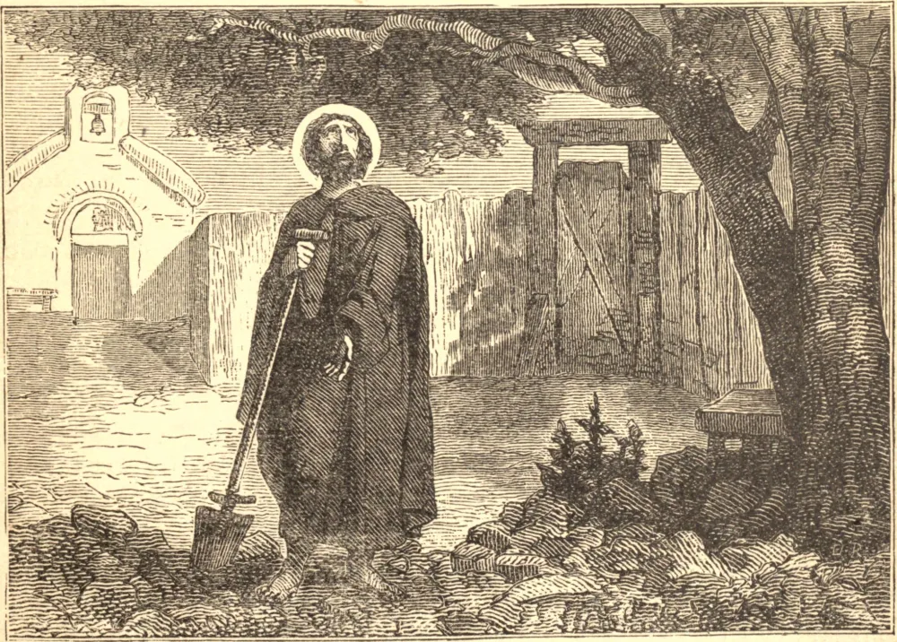

# SÃO FIACRO, Anacoreta

SÃO FIACRO era de nobre nascimento na Irlanda, e teve a sua educação sob os cuidados de um bispo de eminente santidade que era, segundo alguns, Conan, Bispo de Soder ou das Ilhas Ocidentais. Considerando todas as vantagens mundanas como escória, deixou a sua pátria e os seus amigos na flor da idade, e, com certos piedosos companheiros, navegou para a França, em busca de alguma solidão na qual pudesse consagrar-se a Deus, desconhecido do resto do mundo.

A divina Providência conduziu-o a São Faro, que era o Bispo de Meaux, e eminente em santidade. Quando São Fiacro a ele se dirigiu, o prelado, encantado com as marcas de extraordinária virtude e capacidade que descobriu neste estrangeiro, deu-lhe uma morada solitária numa floresta chamada Breuil, que era seu próprio patrimônio, a duas léguas de Meaux.

Neste lugar, o santo anacoreta desbravou o solo de árvores e espinheiros, fez para si uma cela, com um pequeno jardim, e construiu um oratório em honra da Santíssima Virgem, no qual passava grande parte dos dias e das noites em oração devota. Cultivava o seu jardim e trabalhava com as próprias mãos para o seu sustento. A vida que levava era das mais austeras, e somente a necessidade ou a caridade interrompiam os seus exercícios de oração e contemplação celeste. Muitos a ele recorriam em busca de conselho, e os pobres em busca de socorro. Mas, seguindo uma regra inviolável entre os monges irlandeses, nunca permitiu que mulher alguma entrasse no recinto de sua ermida.

São Chillen, ou Kilian, irlandês de alta linhagem, em seu regresso de Roma, visitou São Fiacro, que era seu parente, e, havendo passado algum tempo sob sua disciplina, foi orientado por seu conselho, com a autoridade dos bispos, a pregar naquela e nas dioceses vizinhas. Esta missão ele executou com admirável santidade e fruto. São Fiacro morreu por volta do ano 670, no dia 30 de agosto.

**Reflexão**—Vós que amais a indolência, ponderai bem estas palavras de São Paulo: "Se alguém não quiser trabalhar, também não coma."
