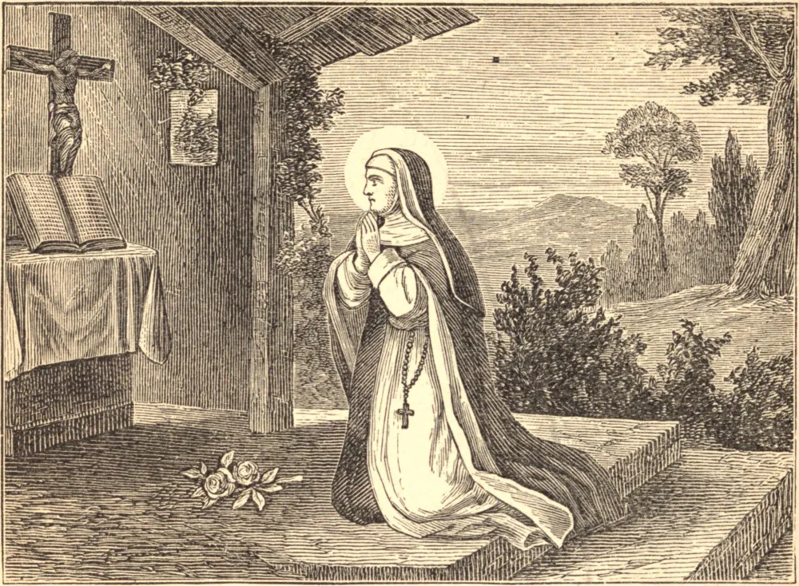

# 30 de agosto — SANTA ROSA DE LIMA

ESTA bela flor de santidade, a primeira Santa canonizada do Novo Mundo, nasceu em Lima, em 1586. Foi batizada com o nome de Isabel, mas a beleza de seu rosto infantil valeu-lhe o título de Rosa, que ela desde então sempre conservou. Quando criança, ainda no berço, seu silêncio sob uma dolorosa operação cirúrgica revelou a sede de sofrimento que já lhe consumia o coração.

Em tenra idade, pôs-se a serviço para sustentar seus pais empobrecidos, e trabalhava por eles dia e noite. Apesar das durezas e austeridades, sua beleza amadurecia com o avançar da idade, e ela era muito e abertamente admirada. Por temor à vaidade, cortou os cabelos, queimou o rosto com pimenta e as mãos com cal. Para maior segurança, inscreveu-se na Terceira Ordem de São Domingos, tomou Santa Catarina de Sena por modelo, e redobrou sua penitência.

Sua cela era uma cabana de jardim, seu leito uma caixa de telhas quebradas. Sob o hábito, Rosa trazia um cilício cravejado de pregos de ferro, enquanto, oculta pelo véu, uma coroa de prata armada de noventa pontas lhe cingia a cabeça. Mais de uma vez, quando ela estremecia diante da perspectiva de uma noite de tortura, uma voz dizia: "Minha cruz foi ainda mais dolorosa."

O Santíssimo Sacramento parecia ser quase o seu único alimento. Seu amor por ele era intenso. Quando a frota holandesa se preparava para atacar a cidade, Rosa tomou seu lugar diante do tabernáculo, e chorava por não ser digna de morrer em sua defesa. Todos os seus sofrimentos eram oferecidos pela conversão dos pecadores, e o pensamento das multidões no inferno estava sempre diante de sua alma. Morreu em 1617, aos trinta e um anos de idade.

**Reflexão**—Rosa, pura como a neve recém-caída, estava cheia da mais profunda contrição e humildade, e fazia constante e terrível penitência. Nossos pecados são contínuos, nosso arrependimento passageiro, nossa contrição leve, nossa penitência nenhuma. Como será de nós?
