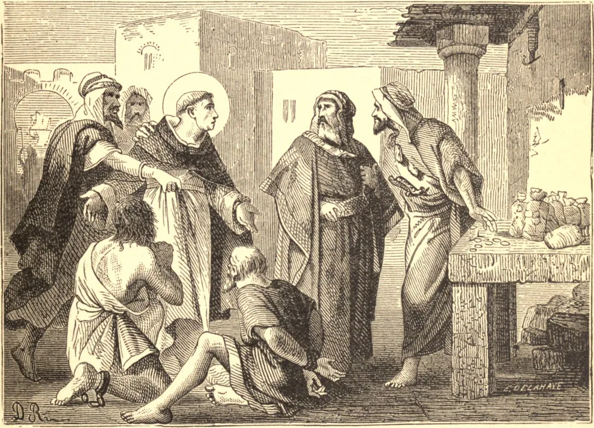

# 31 de agosto — SÃO RAIMUNDO NONATO

SÃO RAIMUNDO NONATO nasceu na Catalunha, no ano de 1204, e descendia de uma família fidalga de pequena fortuna. Em sua infância parecia encontrar prazer somente em suas devoções e em seus deveres sérios. Seu pai, percebendo nele uma inclinação ao estado religioso, tirou-o da escola, e enviou-o a cuidar de uma fazenda que possuía no campo. Raimundo prontamente obedeceu, e, a fim de gozar a oportunidade da santa solidão, ele mesmo guardava as ovelhas, e passava o tempo nas montanhas e florestas em santa meditação e oração. Algum tempo depois, ingressou na nova Ordem de Nossa Senhora das Mercês para a redenção dos cativos, e foi admitido à sua profissão em Barcelona pelo santo fundador, São Pedro Nolasco. Dois ou três anos depois de sua profissão, foi enviado à Barbária com uma soma considerável de dinheiro, onde comprou, em Argel, a liberdade de grande número de escravos. Quando todo este tesouro se esgotou, entregou-se a si mesmo como refém pelo resgate de outros tantos. Este magnânimo sacrifício serviu apenas para exasperar os maometanos, que o trataram com incomum barbárie, até que, temendo que, se ele morresse em suas mãos, perdessem o resgate que devia ser pago pelos escravos por quem ele permanecia refém, deram ordens para que fosse tratado com maior humanidade. Em razão disto, foi-lhe permitido sair pelas ruas, liberdade que ele aproveitou para confortar e encorajar os cristãos em suas cadeias, e converteu e batizou alguns maometanos. Por isto o governador o condenou a ser morto pela transfixação de uma estaca no corpo, mas seu castigo foi comutado, e ele sofreu uma cruel bastonada. Este tormento não abateu sua coragem. Enquanto via almas em perigo de perecer eternamente, julgava nada ainda ter feito. São Raimundo não tinha mais dinheiro para empregar na libertação de pobres cativos, e falar a um maometano sobre o assunto da religião era morte. Podia, contudo, ainda empenhar seus esforços, com esperança de algum êxito, ou de morrer mártir da caridade. Retomou, portanto, seu antigo método de instruir e exortar tanto os cristãos quanto os infiéis. O governador, que estava enfurecido, ordenou que nosso Santo fosse barbaramente torturado e aprisionado até que seu resgate fosse trazido por alguns religiosos de sua Ordem, que foram enviados com ele por São Pedro. Ao regressar à Espanha, foi nomeado cardeal pelo Papa Gregório IX, e o Papa, desejoso de ter junto de si tão santo homem, chamou-o a Roma. O Santo obedeceu, mas não foi além de Cardona, quando foi acometido de uma violenta febre, que se mostrou mortal. Morreu no dia 31 de agosto, no ano de 1240, o trigésimo sétimo de sua idade.

## Reflexão

Este Santo deu não somente seus bens, mas a sua liberdade, e até se expôs aos mais cruéis tormentos e à morte, pela redenção dos cativos e pela salvação das almas. Mas, ai! não recusamos nós, apenas para satisfazer nossa prodigalidade, vaidade ou avareza, dar a parte supérflua de nossas posses aos pobres, que por falta dela perecem de frio e de fome? Lembremo-nos de que "Aquele que dá ao pobre não passará necessidade."
