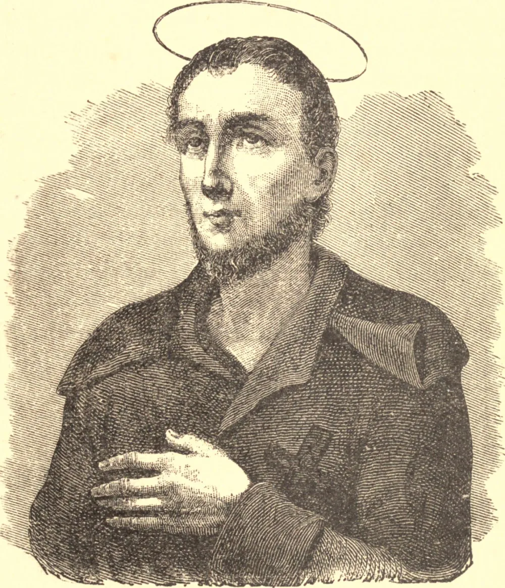

# São Bento José Labre

Este santo servo de Deus, filho de pais piedosos, nasceu em 26 de março de 1748, em Amettes, perto de Boulogne, na França. Seus tios, tanto do lado paterno quanto do materno, eram párocos, um na aldeia vizinha de Erin e o outro em Pesse, que também ficava bem perto de Amettes. À época do nascimento de nosso Santo, uma peste de irreligião assolava a França, mas a fé simples e a vida humilde de seus pais preservaram-nos do contágio. O amor que prodigalizavam a Bento era retribuído com afeto e obediência; aliás, esta última era um traço distintivo do caráter do menino. Certa vez, o sacerdote encarregado da escola que ele frequentava acusou intencionalmente nosso Santo de uma falta que não cometera, a fim de provar sua obediência. O menino declarou sua inocência; ao que o sacerdote, fingindo-se irado, acusou-o de mentir e mandou-o sair para ser castigado. Bento não fez mais nenhuma defesa, mas preparava-se para receber o castigo, em vez do qual encontrou palavras de encorajamento e aprovação. Desde a infância, a instrução religiosa sempre encontrou em nosso Santo um ouvinte atento: servia à Missa com uma devoção notável, ia frequentemente confessar-se e seguia com atenção apurada as cerimônias das várias devoções. Já então ansiava por abandonar o mundo e servir a Deus na solidão. Sua mãe, querendo desencorajar o que considerava mera fantasia infantil, disse-lhe que ele provavelmente sofreria por falta de alimento adequado; mas, com uma sabedoria além de seus anos, ele respondeu que os eremitas de outrora viviam de raízes e ervas, e que ele podia fazer o mesmo. "Mas", retorquiu sua mãe, "os homens eram mais fortes naqueles tempos do que agora." "Ah", replicou o Santo, "a graça de Deus é sempre forte; e Ele sustentou Seus servos então; por que não agora?" Costumava muitas vezes dormir no chão nu, com um tronco por travesseiro, e frequentemente privava-se de alimento.

Aos doze anos foi viver com seu tio, o sacerdote de Erin, homem santo, que tomou sobre si a educação religiosa do menino, enviando-o a uma escola vizinha para o latim e os demais estudos. A amabilidade e a docilidade de Bento logo o tornaram querido a seu tio e a seu mestre, e ele progredia excelentemente em seus estudos quando subitamente manifestou por eles uma aversão que em vão se esforçou por vencer. Por mais que fizesse, não conseguia reavivar seu antigo amor pelos livros. Um único pensamento lhe enchia a mente; um único estudo o atraía: como fazer a vontade de Deus, como melhor O servir. Seu tio, que contava ver nosso Santo ordenado e a auxiliá-lo no cuidado da paróquia, ficou grandemente desapontado quando Bento, então com cerca de dezesseis anos, anunciou sua intenção de unir-se aos trapistas, a Ordem mais rigorosa de suas redondezas. Mas o bom ancião não havia de preocupar-se por muito tempo, pois por essa época uma epidemia levou muitos dos habitantes de Erin, e entre eles o fiel pastor, que sacrificou a vida por seu rebanho.

Com o coração entristecido, Bento regressou para casa, onde prosseguiu em sua vida de abnegação e penitência. Por fim, ficou decidido que iria residir com seu outro tio em Pesse. Logo se tornou evidente, porém, que o coração de nosso Santo estava posto na vida religiosa; e, após permanecer alguns meses com o tio, ele, com o consentimento dos pais, partiu para La Trappe. Embora a distância fosse de mais de cento e cinquenta milhas, fez a jornada a pé, por estradas ruins e com tempo severo, e chegou ao convento exausto e mais do que meio doente, apenas para ser recusado. Estava em farrapos e meio morto pela exposição e pela falta de alimento quando chegou em casa. De modo algum desanimado, mal recuperou as forças tentou mais uma vez obter admissão em um mosteiro, mas foi novamente recusado. Por fim, depois de recusado cinco vezes ao todo por uma ou outra Ordem religiosa, convenceu-se de que Deus Todo-Poderoso queria que ele deixasse seu lar e sua pátria e viajasse a pé como peregrino aos santuários da Europa. E assim partiu. Não tinha dinheiro, nem pedia nenhum. Seu alimento era pão que lhe davam, legumes, cascas de frutas ou qualquer resto que pudesse encontrar na rua. Suas roupas eram farrapos imundos, atados à cintura por cordas com nós. Vivendo esta penitência que a si mesmo impusera, separado da sociedade e da caridade daqueles que temia pudessem afastá-lo de seu amor por Deus, fez onze peregrinações à Santa Casa de Loreto, além das que fez a outras peregrinações.

A Quaresma de 1783 encontrou-o em Roma, doente e exausto por suas contínuas jornadas. Na quarta-feira da Semana Santa, 16 de abril, seu corpo enfraquecido sucumbiu, e ele caiu desfalecido nos degraus de uma igreja. Um açougueiro que sempre se interessara pelo Santo, vendo-o nesse estado, mandou conduzi-lo à sua casa, onde, às oito horas da noite, justamente quando os sinos da igreja tocavam a Salve Rainha, sua alma pura partiu, sua peregrinação chegou ao fim, e ele descansou na casa de seu Pai. Naquela noite ressoou por Roma o clamor: "O Santo morreu." Pessoas que dele se afastavam em vida vinham agora ansiosas contemplar-lhe o rosto na morte, e os farrapos que antes todos repugnavam eram agora pedidos como relíquias.

É digno de nota que a luz da fé foi concedida a um de nossos primeiros convertidos americanos, o Rev. John Thayer, ministro protestante de Boston, enquanto este investigava os milagres relatados de nosso Santo. O Sr. Thayer estava em Roma à época da morte do Santo e, achando-se na companhia de alguns amigos ingleses, discutiram-se os alegados milagres. Os protestantes neles não acreditavam e deles zombavam, mas um católico que ali estava presente ofereceu-se para apostar que ninguém da companhia ousaria honestamente investigá-los. Como ministro protestante, o Sr. Thayer sentiu-se obrigado a aceitar a aposta. Iniciou a investigação de boa-fé, e por recompensa tornou-se católico e sacerdote.
