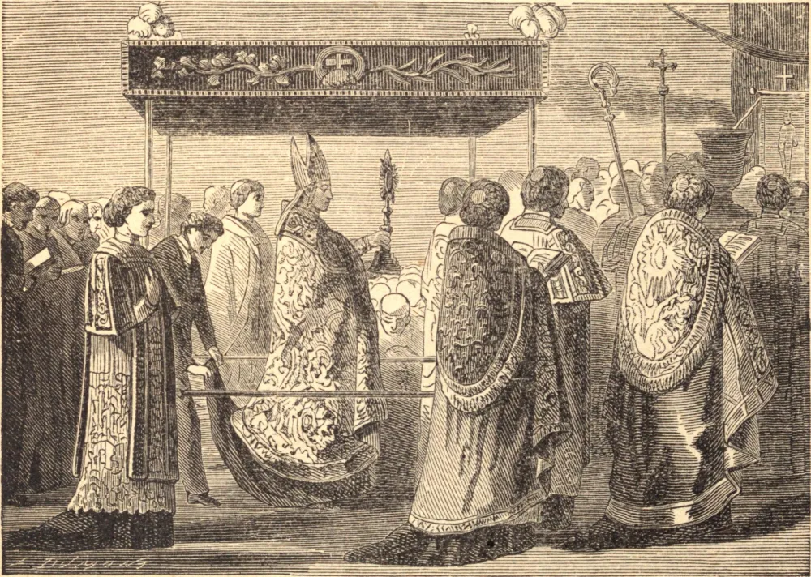

# Corpus Christi

Até o século treze, a Igreja não havia pensado em estabelecer uma festividade especial em honra do Santíssimo Sacramento, contentando-se em celebrar na Quinta-feira Santa a instituição deste divino mistério. Naquele período, contudo, como heresiarcas ousavam atacar a Presença Real de Jesus Cristo na Eucaristia, e numerosos milagres e revelações especiais haviam ocorrido para concentrar a atenção do mundo católico sobre este dogma, o Papa Urbano IV decretou, em 1244, que se instituísse uma festa especial, a qual, por sua solenidade e pompa, fosse como um protesto em favor da fé inabalável da Igreja, e oferecesse, ao mesmo tempo, uma honrosa reparação pelas blasfêmias dos homens ímpios. Mas, vindo este pontífice a falecer pouco depois, a Bula não teve todo o efeito pretendido, e foi somente após o Concílio de Vienne, realizado em 1332, que a festa do Santíssimo Sacramento, ou Corpus Christi, ficou definitivamente estabelecida em todo o mundo católico. O Santo Concílio de Trento de novo aprovou de maneira formal e fervorosa tanto o culto em si como a pompa que o acompanha.

A Festa de Corpus Christi é, pois, um ato solene de fé na Presença Real de Jesus Cristo na Santíssima Eucaristia; e esta crença, à qual a Igreja atribui uma importância da maior monta, é o próprio fundamento da Catolicidade, ou antes, é a própria essência de todo o Cristianismo; porque, se Jesus Cristo não está presente real e corporalmente sob os elementos do pão e do vinho, como Ele mesmo formalmente nos disse, Sua palavra já não é digna de confiança, Ele já não é Deus, e da religião nada resta senão uma bela mas estéril filosofia, que cada um pode remodelar segundo o seu próprio espírito. Se for lícito, como pretendem os protestantes, interpretar, num sentido puramente alegórico, palavras de tal clareza que não há, em todo o Evangelho, nenhuma mais positiva ou precisa, é permitido interpretar tudo a bel-prazer, e o Evangelho permanece um enigma, cuja solução em parte alguma se há de encontrar. É, além disso, intenção da Igreja fazer uma declaração de seu amor e gratidão a Jesus Cristo, e oferecer reparação por todas as profanações e sacrilégios a que este adorável sacramento tem sido exposto.

**Reflexão**—Ó cristãos de coração fraco e mornos! Ó vós, infiéis, descrentes e hereges de todas as eras! "se conhecêsseis o dom de Deus, talvez Lho tivésseis pedido, e Ele vos teria dado água viva!"
