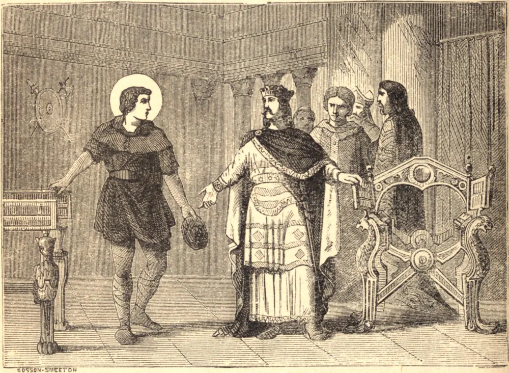

# 1 de dezembro — SANTO ELÓI

ELÓI, ourives em Paris, foi incumbido pelo Rei Clotário de fazer um trono. Com o ouro e as pedras preciosas que lhe foram dados, fez dois. Impressionado por sua rara honestidade, o rei deu-lhe um cargo na corte, e exigiu um juramento de fidelidade prestado sobre santas relíquias; mas Elói suplicou com lágrimas que fosse dispensado, por temor de faltar à reverência devida às relíquias dos Santos. Ao entrar na corte, fortificou-se contra suas seduções por meio de muitas austeridades e contínuas orações jaculatórias.

Tinha um zelo maravilhoso pela redenção dos cativos, e por sua libertação vendia suas joias, seu alimento, suas roupas e até seus próprios sapatos, certa vez quebrando suas cadeias e abrindo suas prisões por suas orações. Sua grande delícia era fazer ricos santuários para relíquias. Sua notável virtude fez com que ele, um leigo e um ourives, fosse feito Bispo de Noyon, e sua santidade neste santo ofício foi notável. Possuía os dons de milagres e de profecia, e morreu em 665.

**Reflexão**—Quando Deus chamou os seus Santos para Si, poderia, se assim Lhe aprouvesse, ter tomado também os seus corpos; mas quis deixá-los a nosso cuidado, para nosso auxílio e consolação. Tem cuidado de imitar Santo Elói no fazer bom uso de tão grande tesouro.
