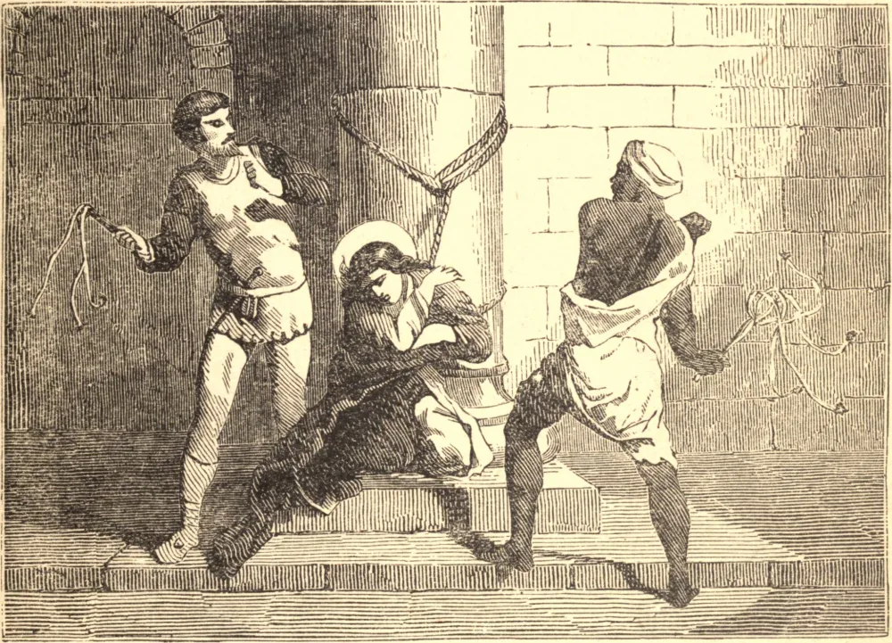

# 2 de dezembro — SANTA BIBIANA, Virgem, Mártir

SANTA BIBIANA era natural de Roma. Flaviano, seu pai, foi preso, queimado no rosto com um ferro em brasa e banido para Aequapendente, onde morreu de seus ferimentos poucos dias depois; e sua mãe, Dafrosa, foi algum tempo depois decapitada. Bibiana e sua irmã Demétria, após a morte de seus pais, foram despojadas de tudo o que tinham no mundo e sofreram muito com a pobreza.

Aproniano, Governador de Roma, intimou-as a comparecer diante dele. Demétria, tendo feito confissão de sua fé, caiu e expirou ao pé do tribunal, na presença do juiz. Aproniano deu ordens para que Bibiana fosse entregue às mãos de uma mulher perversa chamada Rufina, que devia conduzi-la a outro modo de pensar; mas Bibiana, fazendo da oração o seu escudo, permaneceu invencível.

Aproniano, enfurecido com a coragem e a perseverança de uma tenra virgem, ordenou que fosse amarrada a uma coluna e açoitada com chicotes carregados de bolas de chumbo até expirar. A Santa sofreu este castigo com alegria, e morreu nas mãos dos algozes.

**Reflexão**—Ora por uma fidelidade e uma paciência como as de Bibiana sob todas as provações, para que nem a conveniência nem qualquer vantagem mundana jamais prevaleçam sobre ti a ponto de transgredires o teu dever.
