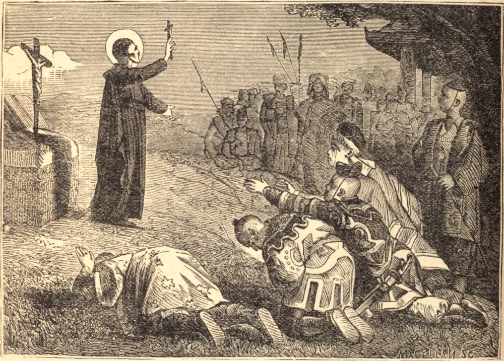

# 3 de dezembro — SÃO FRANCISCO XAVIER

UM jovem fidalgo espanhol, nos dias perigosos da Reforma, estava fazendo nome para si como Professor de Filosofia na Universidade de Paris, e aparentemente não tinha objetivo mais alto, quando Santo Inácio de Loiola o conquistou para os pensamentos celestiais. Após um breve apostolado entre seus compatriotas em Roma, foi enviado por Santo Inácio às Índias, onde por doze anos haveria de consumir-se, levando o Evangelho ao Indostão, a Malaca e ao Japão. Contrariado pela inveja, pela cobiça e pela negligência daqueles que deveriam tê-lo ajudado e encorajado, nem a oposição deles nem as dificuldades de toda sorte que encontrou puderam fazê-lo afrouxar seus labores pelas almas. O vasto reino da China apelava à sua caridade, e estava resolvido a arriscar a vida para forçar uma entrada, quando Deus o tomou para Si, e no dia 2 de dezembro de 1552, morreu, como Moisés, à vista da terra da promissão.

## Reflexão

Alguns são especialmente chamados a trabalhar pelas almas; mas não há ninguém que não possa auxiliar muito em sua salvação. O santo exemplo, a fervorosa intercessão, o oferecimento de nossas ações em seu favor — tudo isto necessita apenas do espírito que animava São Francisco Xavier, o desejo de fazer algum retorno a Deus.
