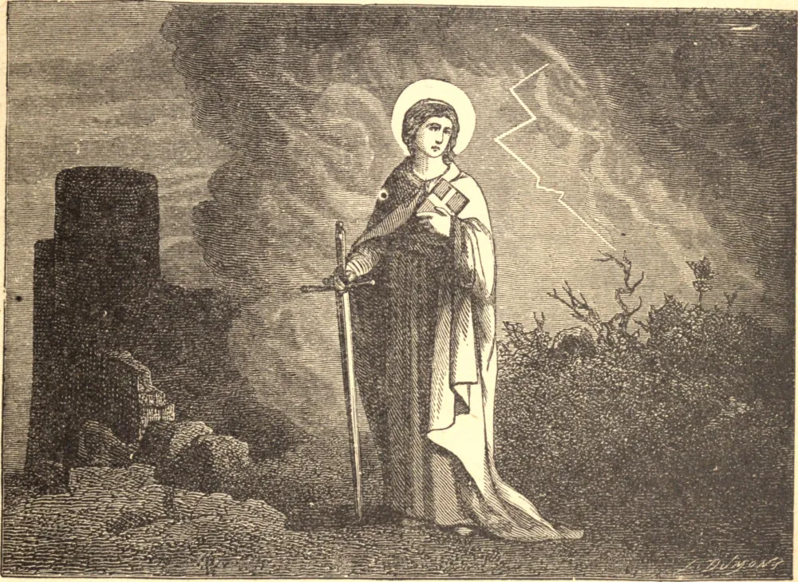

# 4 de dezembro — SANTA BÁRBARA, Virgem, Mártir

SANTA BÁRBARA foi criada como pagã. Um pai tirânico, Dióscoro, mantivera-a ciumentamente reclusa numa torre solitária que construíra para esse fim. Ali, em sua forçada solidão, entregou-se à oração e ao estudo, e conseguiu receber instrução e o Batismo às escondidas de um sacerdote cristão. Dióscoro, ao descobrir a conversão de sua filha, ficou fora de si de raiva. Ele mesmo a denunciou perante o tribunal civil. Bárbara foi horrivelmente torturada, e por fim foi decapitada, seu próprio pai, impiedoso até o último momento, agindo como seu algoz. Deus, porém, prontamente puniu seus perseguidores. Enquanto sua alma era levada pelos anjos ao Paraíso, um relâmpago fulminou Dióscoro, e ele foi arrebatado para diante do tribunal de Deus.

## Reflexão

Ora frequentemente contra uma morte súbita e desprevenida; e, acima de tudo, para que sejas fortalecido pelo Santo Viático contra os perigos de tua última hora.
