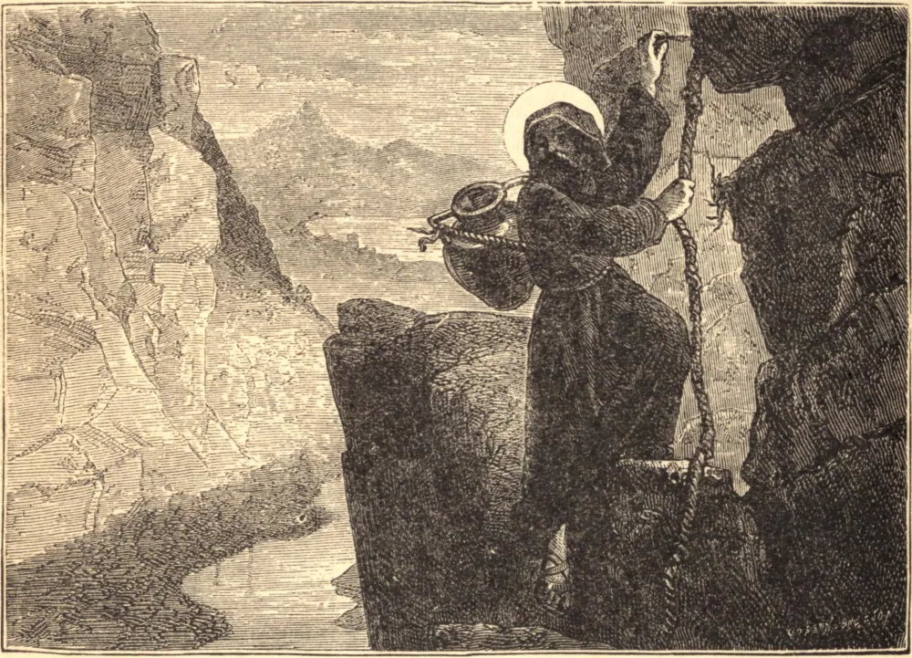

# 5 de dezembro — SÃO SABAS, Abade

SÃO SABAS, um dos mais renomados patriarcas dos monges da Palestina, nasceu no ano de 439, perto de Cesareia. A fim de resolver uma disputa que surgira entre alguns de seus parentes a respeito da administração de seus bens, ainda jovem abandonou o mundo e entrou num mosteiro, no qual se tornou um modelo de fervor.

Quando Sabas estava havia dez anos neste mosteiro, tendo dezoito anos de idade, foi a Jerusalém visitar os lugares santos, e ligou-se a um mosteiro então sob a direção de Santo Eutímio; mas, com a morte do santo abade, nosso Santo buscou o ermo, onde escolheu sua morada numa caverna no alto de uma alta montanha, ao pé da qual corria o ribeiro Cedron.

Depois de haver vivido ali cinco anos, vários vieram a ele, desejando servir a Deus sob sua direção. A princípio relutou em consentir, mas finalmente fundou um novo mosteiro de pessoas todas desejosas de dedicar-se a louvar e servir a Deus sem interrupção. Tornando-se conhecida sua grande santidade, foi ordenado sacerdote, aos cinquenta e três anos, pelo patriarca de Jerusalém, e feito Superior-Geral de todos os anacoretas da Palestina. Viveu até os noventa e quatro anos, e morreu no dia 5 de dezembro de 532.
