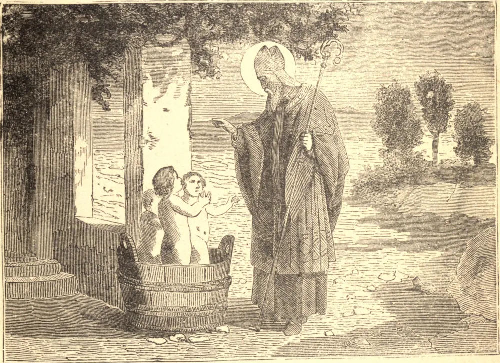

# 6 de dezembro — SÃO NICOLAU DE BARI

SÃO NICOLAU, o Santo padroeiro da Rússia, nasceu por volta do fim do terceiro século. Seu tio, o Arcebispo de Mira na Lícia, ordenou-o sacerdote e nomeou-o abade de um mosteiro; e, com a morte do arcebispo, foi eleito para a sé vacante. Ao longo de toda a sua vida conservou as maneiras alegres e cândidas de seus primeiros anos, e mostrou-se o protetor especial dos inocentes e dos injustiçados.

Nicolau certa vez ouviu que uma pessoa que caíra na pobreza tencionava abandonar suas três filhas a uma vida de pecado. Determinado, se possível, a salvar sua inocência, o Santo saiu de noite, e, levando consigo um saco de ouro, lançou-o pela janela do pai adormecido e apressou-se a partir. Este, ao despertar, julgou o presente uma dádiva do céu, e com ele dotou sua filha mais velha. O Santo, transbordante de alegria com seu êxito, fez igual empresa pela segunda filha; mas da terceira vez, ao esgueirar-se, o pai, que estava à espreita, alcançou-o e beijou-lhe os pés, dizendo: "Nicolau, por que te ocultas de mim? Tu és meu auxiliador, e aquele que livrou do inferno a minha alma e a de minhas filhas."

São Nicolau é geralmente representado ao lado de uma vasilha, na qual certo homem ocultara os corpos de seus três filhos que matara, mas que foram restituídos à vida pelo Santo. Morreu em 342. Suas relíquias foram trasladadas em 1807 para Bari, na Itália, e ali, após quinze séculos, "o maná de São Nicolau" ainda flui de seus ossos e cura toda sorte de enfermos.

**Reflexão**—Aqueles que quiserem entrar no céu devem ser como criancinhas, cuja maior glória é a sua inocência. Ora, duas coisas nos cabe fazer: primeiro, conservá-la em nós mesmos, ou recuperá-la pela penitência; segundo, amá-la e protegê-la nos outros.
