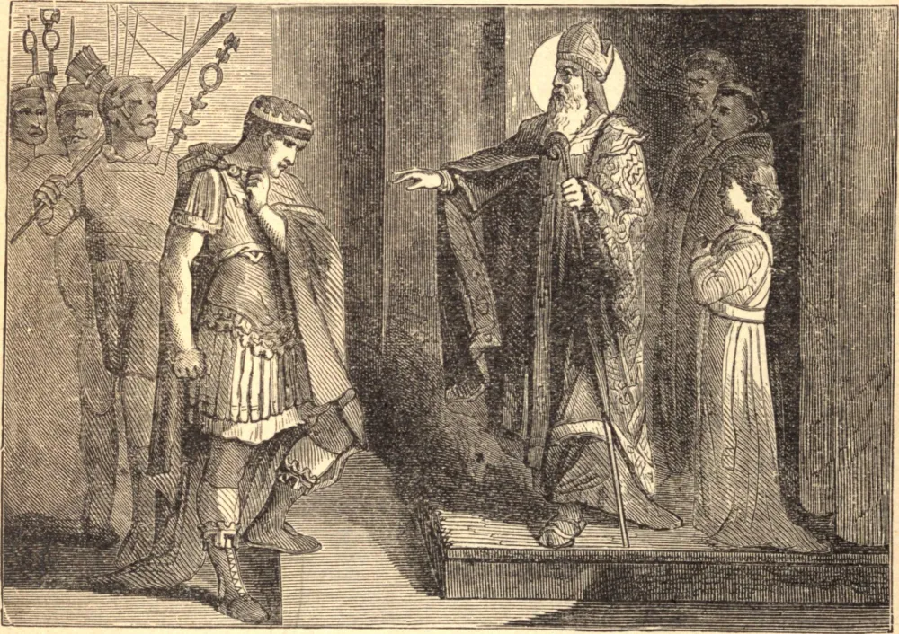

# 7 de dezembro — SANTO AMBRÓSIO, Bispo

AMBRÓSIO era de família nobre, e era governador de Milão em 374, quando se devia escolher um bispo para aquela grande sé. Como os hereges arianos eram muitos e ferozes, ele estava presente para manter a ordem durante a eleição. Embora fosse apenas um catecúmeno, foi vontade de Deus que ele próprio fosse escolhido por aclamação; e, apesar de sua mais extrema resistência, foi batizado e consagrado.

Era incansável em todo dever de pastor, cheio de compaixão e caridade, brando e condescendente nas coisas indiferentes, mas inflexível nas matérias de princípio. Mostrou seu destemido zelo ao afrontar a ira da Imperatriz Justina, resistindo e frustrando sua ímpia tentativa de entregar uma das igrejas de Milão aos arianos, e ao repreender e conduzir à penitência o verdadeiramente grande Imperador Teodósio, que, num momento de irritação, punira com a maior crueldade uma sedição dos habitantes de Tessalônica.

Foi o amigo e consolador de Santa Mônica em todas as suas tristezas, e em 387 teve a alegria de admitir na Igreja seu filho, Santo Agostinho. Santo Ambrósio morreu em 397, cheio de anos e de honras, e é venerado pela Igreja como um de seus maiores doutores.

**Reflexão**—De onde veio a Santo Ambrósio sua grandeza de espírito, sua clareza de discernimento, sua intrepidez em manter a fé e a disciplina da Igreja? De onde, senão de seu desprezo do mundo, de seu temer a Deus somente?
