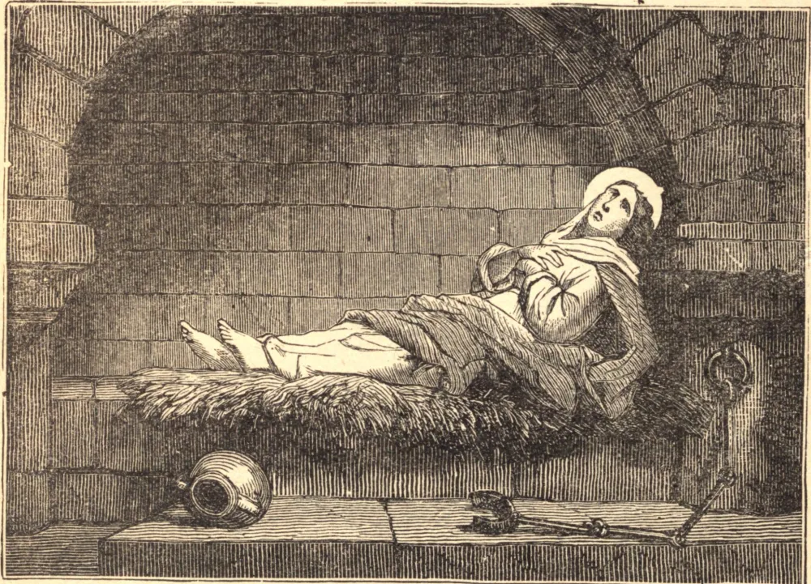

# 9 de dezembro — SANTA LEOCÁDIA, Virgem, Mártir

SANTA LEOCÁDIA era natural de Toledo, e foi presa por ordem de Daciano, o cruel governador sob Diocleciano, em 304. Ao ouvir falar do martírio de Santa Eulália, rogou que Deus não prolongasse o seu exílio, mas a unisse prontamente à sua santa amiga na Sua glória. Sua oração foi atendida, e ela ditosamente expirou no cárcere. Três famosas igrejas em Toledo levam o seu nome, e ela é honrada como principal padroeira daquela cidade. Em uma dessas igrejas realizaram-se a maior parte dos concílios de Toledo. Suas relíquias foram guardadas naquela igreja com grande respeito, até que, nas incursões dos mouros, foram levadas para Oviedo, e alguns anos depois para a abadia de São Guislain, perto de Mons, no Hainault. Por fim foram trazidas de volta a Toledo com grande pompa, e colocadas na grande igreja de lá no dia 26 de abril de 1589.

## Reflexão

Se não estivéssemos cegos pelo mundo e pelo encanto de suas loucuras, a iminente perspectiva da eternidade, a incerteza da hora de nossa morte e os repetidos preceitos de Cristo produziriam em nós as mesmas fervorosas disposições que produziram nos primeiros cristãos.
