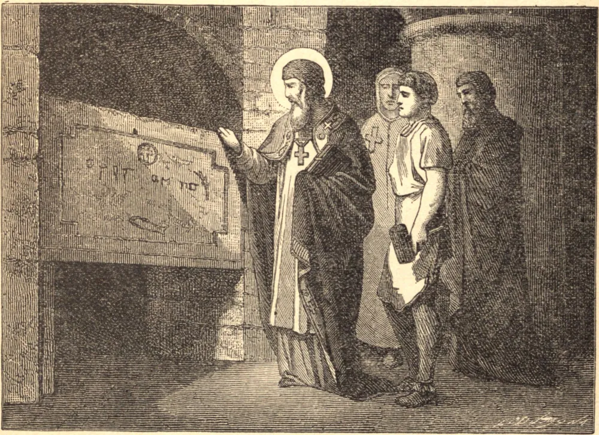

# 11 de dezembro — SÃO DÂMASO, Papa

SÃO DÂMASO nasceu em Roma no princípio do quarto século. Era arcediago da Igreja Romana em 355, quando o Papa Libério foi desterrado para Berda, e seguiu-o ao exílio, mas depois retornou a Roma. Por morte de Libério, nosso Santo foi escolhido para sucedê-lo. Ursino, um competidor para o alto ofício, incitou uma revolta, mas o santo Papa tomou apenas as medidas que convinham ao pai comum dos fiéis. Tendo livrado a Igreja deste novo cisma, voltou sua atenção para a extirpação do arianismo no Ocidente e do apolinarismo no Oriente, e para este fim convocou vários concílios. Reconstruiu a igreja de São Lourenço, que até hoje é conhecida como São Lourenço *in Damaso;* fez muitas valiosas dádivas a esta igreja, e estabeleceu sobre ela casas e terras em sua vizinhança. Igualmente drenou todas as fontes do Vaticano, que corriam sobre os corpos ali sepultados, e decorou os sepulcros de grande número de mártires nos cemitérios, e os adornou com epitáfios em verso. Tendo ocupado a sé dezoito anos e dois meses, morreu no dia 10 de dezembro de 384, estando perto dos oitenta anos de idade.
