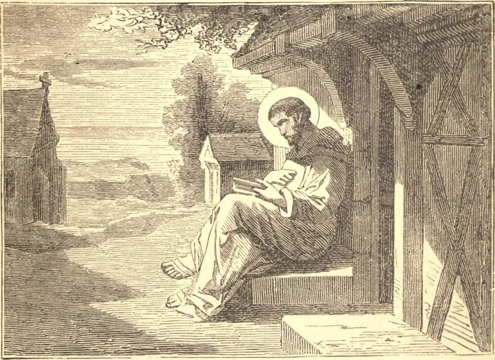

# 12 de dezembro — SÃO VALÉRIO, Abade — SÃO FINIANO, Bispo

ESTE Santo nasceu na Auvérnia, no sexto século, e em sua infância guardava as ovelhas de seu pai. Ainda era jovem quando tomou o hábito monástico no vizinho mosteiro de Santo Antão. Buscando os meios mais perfeitos de avançar nos caminhos de todas as virtudes, passou desta casa para o mais austero mosteiro de São Germano de Auxerre, e finalmente para o de Luxeuil, onde passou muitos anos. Viajou para a Nêustria, onde converteu muitos infiéis, e reuniu certos fervorosos discípulos, e lançou os alicerces de um mosteiro. São Valério foi receber a recompensa de sua ditosa perseverança no dia 12 de dezembro de 622.

SÃO FINIANO era natural de Leinster, foi instruído nos elementos da virtude cristã pelos discípulos de São Patrício, e passou ao País de Gales; mas por volta do ano 520 retornou à Irlanda. Para propagar a obra de Deus, nosso Santo estabeleceu vários mosteiros e escolas. São Finiano foi escolhido e sagrado Bispo de Clonard. No amor de seu rebanho e em seu zelo pela salvação deles, era enfermo com os enfermos, e chorava com os que choravam. Curava as almas, e muitas vezes também os corpos, daqueles que a ele recorriam. Partiu para Nosso Senhor no dia 12 de dezembro de 552.
