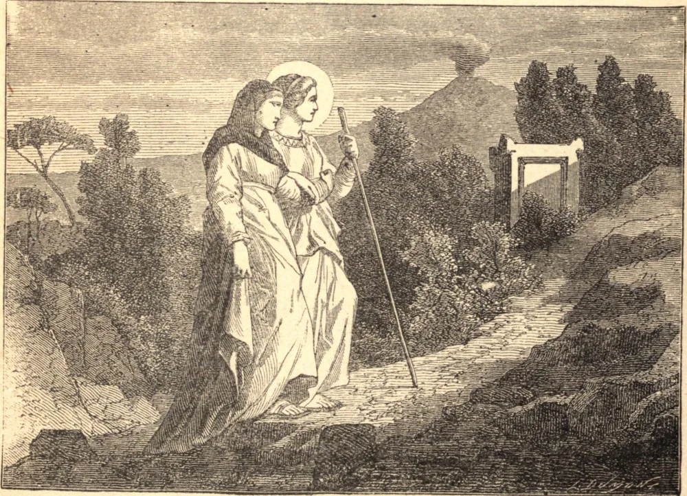

# 13 de dezembro — SANTA LUZIA, Virgem, Mártir

A MÃE de Santa Luzia padeceu quatro anos de um fluxo de sangue, e o auxílio dos homens falhou. Santa Luzia lembrou à sua mãe que uma mulher no Evangelho fora curada da mesma enfermidade. "Santa Águeda", disse ela, "está sempre na presença d'Aquele por Quem morreu. Toca apenas o seu sepulcro com fé, e serás curada."

Passaram a noite orando junto ao túmulo, até que, vencidas pelo cansaço, ambas adormeceram. Santa Águeda apareceu em visão a Santa Luzia, e, chamando-a irmã, predisse a recuperação de sua mãe e o seu próprio martírio. Naquele instante a cura se efetuou; e em sua gratidão a mãe permitiu que a filha distribuísse os seus bens entre os pobres, e consagrasse a sua virgindade a Cristo.

Um jovem a quem ela havia sido prometida em casamento acusou-a como cristã perante os pagãos; mas Nosso Senhor, por um milagre especial, salvou do ultraje esta virgem que havia escolhido para Si. O fogo aceso ao redor dela não lhe causou nenhum dano. Então a espada foi cravada em seu coração, e cumpriu-se a promessa feita junto ao túmulo de Santa Águeda.

**Reflexão**—Os Santos tiveram de suportar sofrimentos e tentações muito maiores que os teus. Como os venceram? Pelo amor de Cristo. Nutre este amor puro meditando nos mistérios da vida de Cristo; e, sobretudo, pela devoção à Santíssima Eucaristia, que é o antídoto contra o pecado e o penhor da vida eterna.
