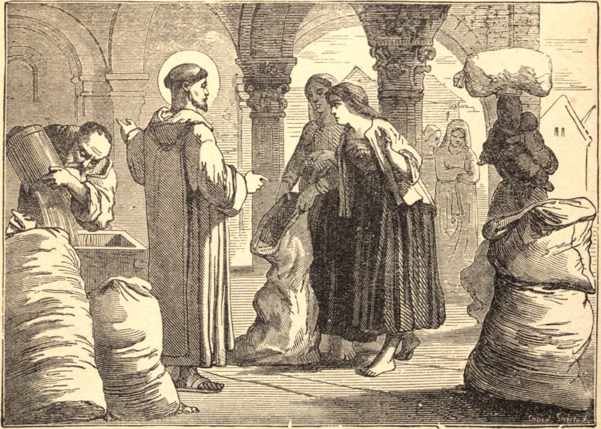

# 15 de dezembro — SÃO MESMIN

SÃO MESMIN era natural de Verdun. Tendo os habitantes daquele lugar se mostrado desleais ao Rei Clóvis, um tio de nosso Santo, um sacerdote chamado Euspício, promoveu uma reconciliação entre o monarca e seus súditos. Clóvis, apreciando as virtudes de Euspício, persuadiu-o a fixar residência na corte, e o servo de Deus levou São Mesmin consigo.

Enquanto viajava para Orleans com Clóvis, notou, a cerca de duas léguas da cidade, além do Loire, um lugar solitário chamado Micy, que lhe pareceu bem adequado para um retiro. Tendo pedido e obtido o lugar, com Mesmin e vários discípulos ali construiu um mosteiro, do qual tomou a direção.

À sua morte, que sucedeu cerca de dois anos depois, nosso Santo foi nomeado abade por Eusébio, Bispo de Orleans. Durante uma terrível fome, alimentou quase toda a cidade de Orleans com o trigo de seu mosteiro, sem reduzi-lo perceptivelmente; também expulsou uma enorme serpente do lugar em que foi depois sepultado. Tendo governado seu mosteiro dez anos, morreu como havia vivido, em odor de santidade, no dia 15 de dezembro de 520.

**Reflexão**—Poucos são chamados a servir a Deus por grandes ações, mas todos estão obrigados a buscar a perfeição nas ações ordinárias de sua vida cotidiana.
