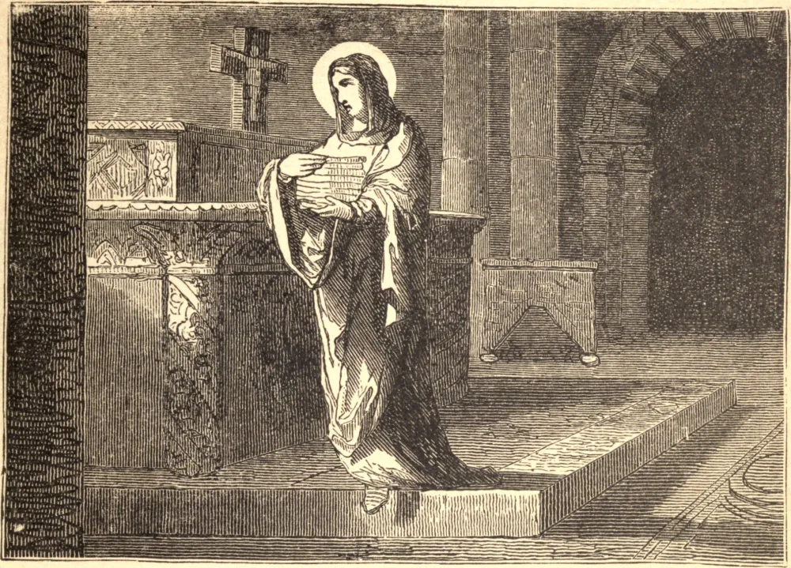

# 17 de dezembro — SANTA OLÍMPIA, Viúva

SANTA OLÍMPIA, a glória das viúvas na Igreja Oriental, era de família nobre e abastada. Deixada órfã em tenra idade, foi criada por Teodósia, irmã de Santo Anfilóquio, uma mulher virtuosa e prudente. Olímpia insensivelmente refletia as virtudes desta estimável mulher.

Casou-se muito jovem, mas, morrendo seu marido dentro de vinte dias após o casamento, recusou modestamente qualquer outra proposta de sua mão, e resolveu consagrar a sua vida à oração e a outras boas obras, e dedicar a sua fortuna aos pobres. Nectário, Arcebispo de Constantinopla, tinha alta estima pela santa viúva, e fê-la diaconisa de sua igreja, cujos deveres eram preparar as toalhas do altar e atender a outros assuntos dessa espécie.

São Crisóstomo, que sucedeu a Nectário, não tinha menos respeito do que seu predecessor por Olímpia, mas recusou-se a ocupar-se da distribuição de suas esmolas. Nossa Santa foi uma das últimas a deixar São Crisóstomo quando este partiu para o desterro no dia 20 de junho de 404. Após a partida dele, ela sofreu grande perseguição, e coroou uma vida virtuosa com uma santa morte, por volta do ano 410.

**Reflexão**—"Não ajunteis para vós tesouros na terra, mas no céu, onde nem a ferrugem nem a traça os consomem."
