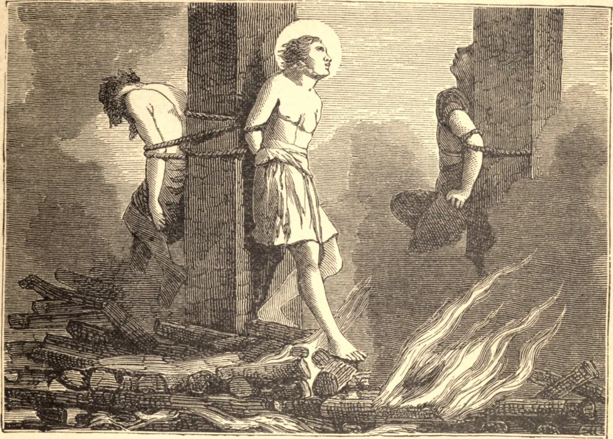

# 19 de dezembro — SÃO NEMÉSIO, Mártir

NA perseguição de Décio, Nemésio, um egípcio, foi preso em Alexandria sob uma acusação de furto. O servo de Cristo facilmente se livrou daquela acusação, mas foi imediatamente acusado de ser cristão, e, depois de açoitado e atormentado mais do que os ladrões, foi condenado a ser queimado com os salteadores e outros malfeitores. Achavam-se ao mesmo tempo, junto ao tribunal do prefeito, quatro soldados e outra pessoa, os quais, sendo cristãos, encorajavam ousadamente um confessor que estava pendurado no potro. Foram levados perante o juiz, que os condenou a serem decapitados, mas ficou pasmo ao ver a alegria com que caminhavam para o local da execução. Heron, Áter e Isidoro, todos egípcios, com Dióscoro, um jovem de apenas quinze anos, foram presos em Alexandria na mesma perseguição. Depois de suportar o mais cruel dilaceramento e deslocamento de seus membros, foram queimados vivos, com exceção de Dióscoro, a quem o juiz soltou por causa da tenra idade.

## Reflexão

Poderemos recordar o fervor dos Santos em trabalhar e sofrer alegremente por Deus, e não sentir um santo ardor abrasar nossos próprios peitos, e nossas almas fortemente comovidas por seus heroicos sentimentos de virtude?
