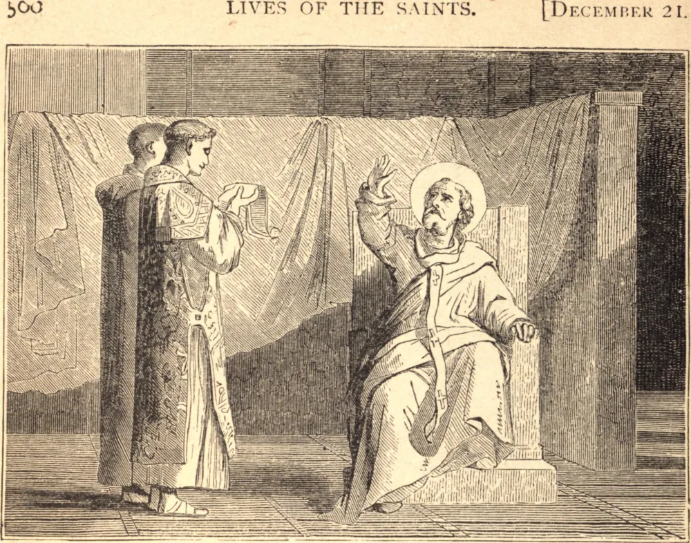

# 20 de dezembro — SÃO FILOGÔNIO, Bispo

SÃO FILOGÔNIO foi educado para o direito e atuou no foro com grande êxito. Era admirado por sua eloquência, mas ainda mais por sua integridade e pela santidade de sua vida. Isto foi considerado motivo suficiente para dispensar os cânones, que exigem algum tempo passado entre o clero antes que uma pessoa seja elevada à mais alta dignidade da Igreja. Filogônio foi colocado na sé de Antioquia, após a morte de Vitalis, em 318. Quando Ário proferiu suas blasfêmias em Alexandria, em 318, Santo Alexandre o condenou e enviou a sentença em uma carta sinodal a São Filogônio, que defendeu vigorosamente a fé católica perante a assembleia do Concílio de Niceia. Nas tempestades que se levantaram contra a Igreja, primeiro por Maximino II e depois por Licínio, São Filogônio mereceu o título de Confessor; faleceu no ano de 322, o quinto de sua dignidade episcopal.

## Reflexão

São Filogônio havia renunciado tão perfeitamente ao mundo, e crucificado em seu coração os desejos desordenados deste, que recebeu nesta vida as arras do Espírito de Cristo, foi admitido ao sagrado concílio do Rei celestial e teve livre acesso ao Todo-Poderoso. Uma alma deve aprender aqui o espírito celestial, e estar bem versada nas ocupações dos bem-aventurados, se espera reinar com eles no porvir.
