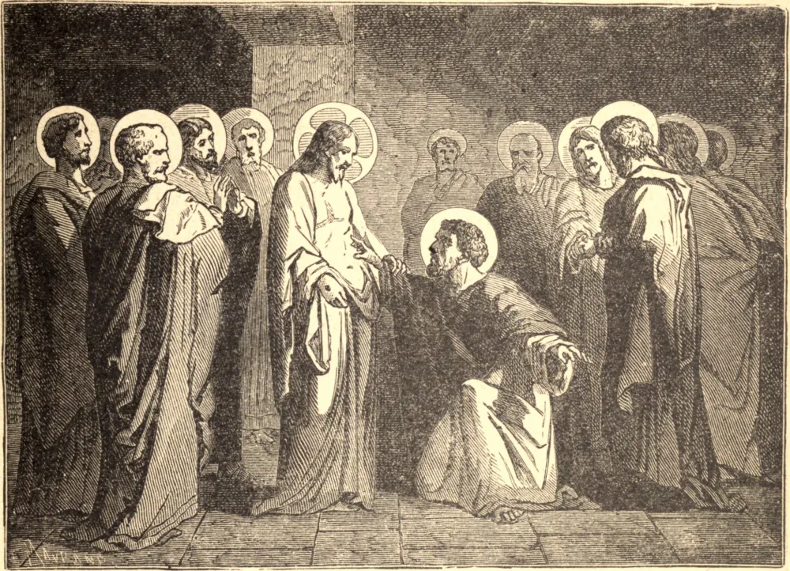

# 21 de dezembro — SÃO TOMÉ, Apóstolo

SÃO TOMÉ era um dos pescadores do Lago da Galileia a quem Nosso Senhor chamou para serem Seus apóstolos. Por natureza lento para crer, demasiado propenso a ver dificuldades e a olhar o lado sombrio das coisas, possuía, contudo, um coração assaz solidário, amoroso e corajoso.

Certa vez, quando Jesus falou das mansões na casa de Seu Pai, São Tomé, em sua simplicidade, perguntou: "Senhor, não sabemos para onde vais, e como podemos saber o caminho?" Quando Jesus se voltou para ir em direção a Betânia, ao sepulcro de Lázaro, o desanimado apóstolo logo temeu o pior para seu amado Senhor, mas bradou corajosamente aos demais: "Vamos também nós, e morramos com Ele."

Após a Ressurreição, a incredulidade prevaleceu novamente e, enquanto as chagas da crucifixão estavam vividamente impressas em sua mente afetuosa, não quis dar crédito à notícia de que Cristo havia de fato ressuscitado. Mas, ao ver de fato as mãos e o lado transpassados, e diante da branda repreensão de seu Salvador, a descrença desapareceu para sempre; e a sua fé e a nossa sempre triunfaram na alegre expressão em que ele prorrompeu: "Meu Senhor e meu Deus!"

**Reflexão**—Lança fora todas as dúvidas inquietantes, e aprende a triunfar sobre as antigas fraquezas como fez São Tomé, que "por sua ignorância instruiu os ignorantes, e por sua incredulidade serviu à fé de todas as eras."
