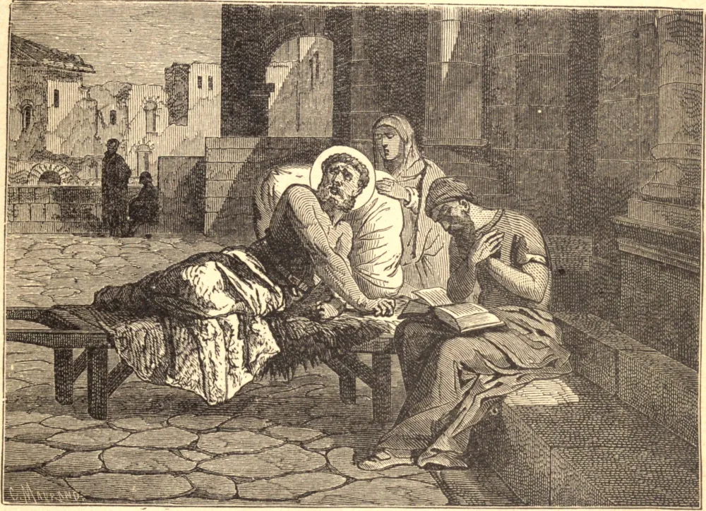

# 23 de dezembro — SÃO SÉRVULO

SÉRVULO era um mendigo, e estivera tão acometido de paralisia desde a infância que jamais foi capaz de pôr-se em pé, sentar-se ereto, levar a mão à boca ou voltar-se de um lado para o outro. Sua mãe e seu irmão o carregavam até o pórtico da Igreja de São Clemente, em Roma, onde vivia das esmolas dos que passavam.

Costumava suplicar às pessoas devotas que lhe lessem as Sagradas Escrituras, as quais ouvia com tamanha atenção que as aprendia de cor. Consagrava o seu tempo cantando assiduamente hinos de louvor e ação de graças a Deus.

Após vários anos passados desta maneira, tendo a sua enfermidade atingido os órgãos vitais, sentiu que o seu fim se aproximava. Em seus últimos momentos, pediu aos pobres e aos peregrinos, que muitas vezes haviam partilhado da sua caridade, que cantassem hinos sagrados e salmos por ele. Enquanto unia a sua voz à deles, exclamou de súbito: "Silêncio! não ouvis a doce melodia e o louvor que ressoam nos céus?" Logo depois de proferir estas palavras, expirou, e a sua alma foi levada pelos anjos à bem-aventurança eterna, por volta do ano de 590.

**Reflexão**—Todo o comportamento deste pobre mendigo enfermo condena fortemente aqueles que, sendo abençoados com boa saúde e fortuna abundante, nem praticam boas obras nem suportam a menor cruz com tolerável paciência.
