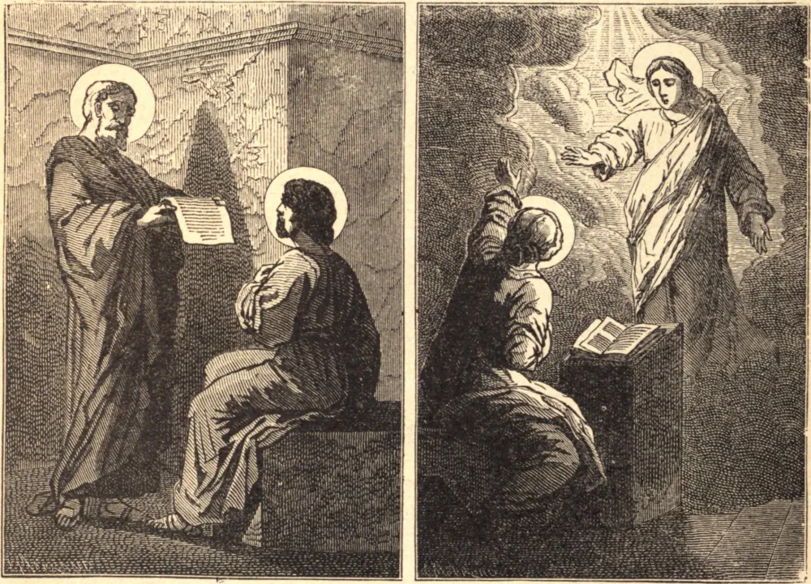

# 24 de dezembro — SÃO DELFINO, Bispo — SANTAS TRASILA e EMILIANA, Virgens

POUCO se sabe de São Delfino antes de sua elevação ao episcopado. Assistiu ao Concílio de Saragoça, em 330, no qual os priscilianistas foram condenados, e também ao Concílio de Bordéus, que condenou os mesmos cismáticos. Batizou São Paulino em 388, e este, em várias cartas, fala dele como seu pai e seu mestre. São Delfino faleceu no dia 24 de dezembro de 403.

SANTAS TRASILA e EMILIANA eram tias de São Gregório Magno. Viviam na casa de seu pai tão retiradas como num mosteiro, longe do convívio dos homens; e, incitando-se uma à outra à virtude pelo discurso e pelo exemplo, logo fizeram considerável progresso na vida espiritual.

Trasila foi favorecida certa noite com uma visão de seu tio, São Félix, Papa, que lhe mostrou um assento preparado para ela no céu, dizendo: "Vem; eu te receberei nesta morada de luz." No dia seguinte adoeceu de febre. Em sua agonia, com os olhos fixos no céu, exclamou aos que estavam presentes: "Retirai-vos! abri caminho! Jesus está vindo." Logo após estas palavras, exalou a sua piedosa alma nas mãos de Deus, no dia 24 de dezembro.

Poucos dias depois, apareceu à sua irmã Emiliana, e a convidou a celebrar com ela a Epifania na bem-aventurança eterna. Emiliana adoeceu e faleceu no dia 8 de janeiro.

**Reflexão**—Podemos muitas vezes pensar que as austeridades dos Santos estão além de nossas forças; imitemos, então, a guarda que mantinham sobre a sua língua. Isto está ao alcance de todos.
