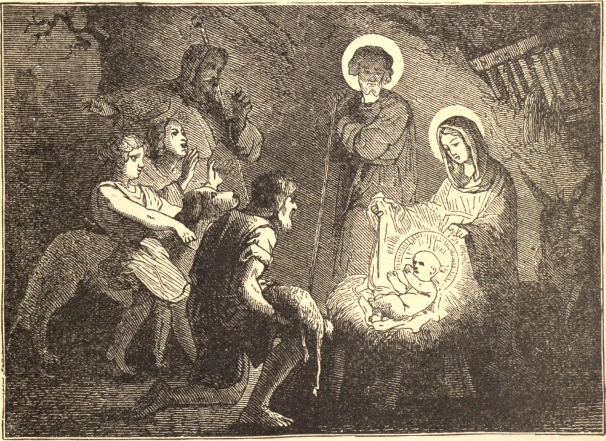

# 25 de dezembro — A NATIVIDADE DE CRISTO, OU DIA DE NATAL

O MUNDO subsistia havia cerca de quatro mil anos quando Jesus Cristo, o eterno Filho de Deus, tendo tomado carne humana no ventre da Virgem Maria, e feito homem, nasceu dela, para a redenção da humanidade, em Belém da Judeia. José e Maria haviam subido a Belém para se alistarem e, não podendo encontrar abrigo em outro lugar, refugiaram-se num estábulo, e neste humilde lugar nasceu Jesus Cristo. A Santíssima Virgem envolveu o divino Infante em faixas e o deitou na manjedoura.

Enquanto os sensuais e os soberbos dormiam, um anjo apareceu a alguns pobres pastores. Foram tomados de grande temor, mas o mensageiro celestial lhes disse: "Não temais: pois eis que vos anuncio uma boa-nova de imensa alegria, que será para todo o povo. Pois hoje vos nasceu um Salvador, que é Cristo, o Senhor, na cidade de Davi. E isto vos servirá de sinal: encontrareis o Menino envolto em faixas e deitado numa manjedoura."

Após a partida do anjo, os admirados pastores diziam uns aos outros: "Vamos até Belém, e vejamos o que sucedeu, que o Senhor nos manifestou." Apressaram-se imediatamente para lá, e encontraram Maria e José, e o Infante deitado na manjedoura. Prostrando-se, adoraram-no, e depois voltaram aos seus rebanhos, glorificando e louvando a Deus.

**Reflexão**—Nosso Salvador santificou a nossa carne ao tomá-la sobre Si, e com Seu último alento confiou-nos aos cuidados de Sua Virgem Mãe. Dia após dia, Ele ainda nos alimenta no altar com o alimento da incorrupção — Seu corpo e Seu sangue.
