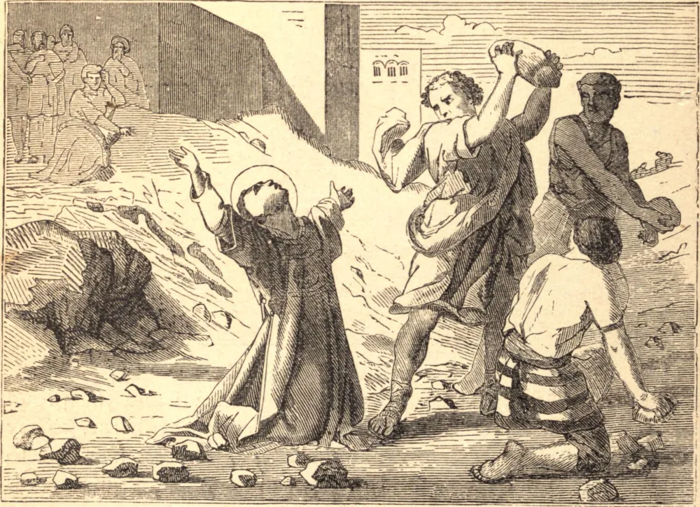

# 26 de dezembro — SANTO ESTÊVÃO, Primeiro Mártir

HÁ bom motivo para crer que Santo Estêvão foi um dos setenta e dois discípulos de nosso bendito Senhor. Após a Ascensão, foi escolhido como um dos sete diáconos. O ministério dos sete foi muito fecundo; mas Estêvão especialmente, "cheio de graça e fortaleza, fazia grandes prodígios e sinais entre o povo." Muitos adversários se levantaram para disputar com ele, mas "não eram capazes de resistir à sabedoria e ao espírito que falava." Por fim, foi levado perante o Sinédrio, acusado, como seu divino Mestre, de blasfêmia contra Moisés e contra Deus. Ele censurou ousadamente os sumos sacerdotes pela sua resistência de coração endurecido ao Espírito Santo e pelo assassinato do "Justo." Eles ficaram feridos de cólera e rangiam os dentes contra ele. Mas quando, "cheio do Espírito Santo e olhando para o céu, ele exclamou: 'Eis que vejo os céus abertos e o Filho do homem em pé à direita de Deus,' precipitaram-se sobre ele e, arrastando-o para fora da cidade, apedrejaram-no até a morte."

## Reflexão

Se alguma vez fores tentado ao ressentimento, reza de coração por aquele que te ofendeu.
