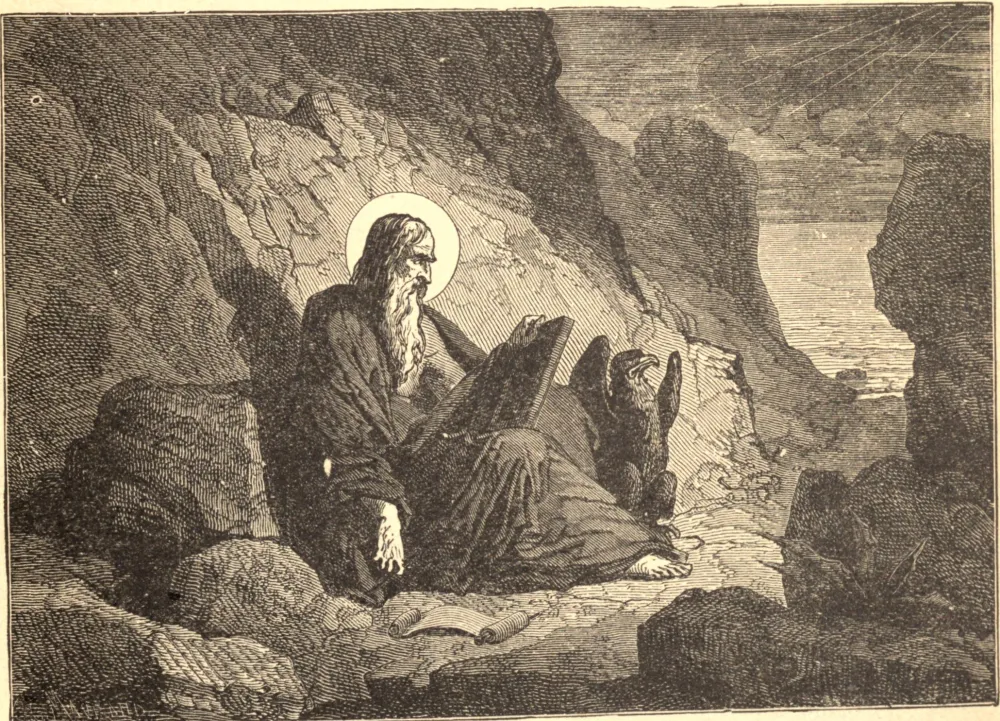

# 27 de dezembro — SÃO JOÃO, Evangelista

SÃO JOÃO, o mais jovem dos apóstolos em idade, foi chamado a seguir Cristo às margens do Jordão durante os primeiros dias do ministério de Nosso Senhor. Foi um dos poucos privilegiados presentes à Transfiguração e à Agonia no jardim. Na Última Ceia, sua cabeça repousou sobre o peito de Jesus, e nas horas da Paixão, quando outros fugiram ou negaram o seu Mestre, São João manteve o seu lugar ao lado de Jesus, e por fim permaneceu junto à cruz com Maria. Da cruz, o Salvador moribundo legou Sua Mãe aos cuidados do fiel apóstolo, que "daquela hora a recebeu como sua;" assim convenientemente, como diz Santo Agostinho, "a uma virgem foi confiada a Virgem." Após a Ascensão, São João viveu primeiro em Jerusalém e depois em Éfeso. Foi lançado por Domiciano num caldeirão de óleo fervente, e por isso é contado como mártir, embora milagrosamente preservado de qualquer dano. Depois foi banido para a ilha de Patmos, onde recebeu as visões celestiais descritas no Apocalipse. Faleceu em idade muito avançada, em paz, em Éfeso, no ano de 100.

## Reflexão

São João é um exemplo vivo da palavra de Nosso Senhor: "Bem-aventurados os puros de coração, porque verão a Deus."
