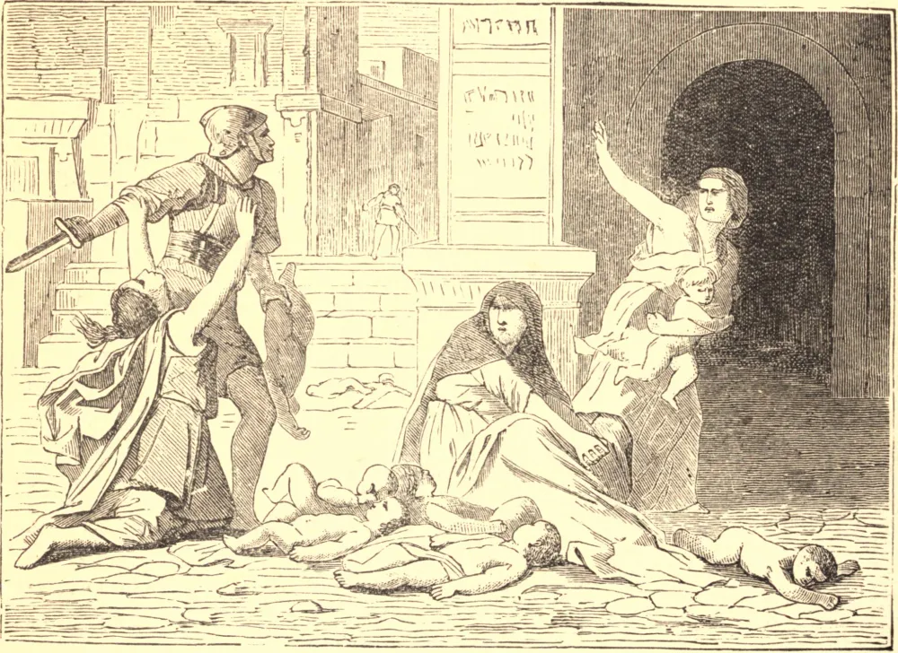

# 28 de dezembro — OS SANTOS INOCENTES

HERODES, que reinava na Judeia ao tempo do nascimento de Nosso Salvador, tendo ouvido que os Magos haviam vindo do Oriente a Jerusalém em busca do Rei dos judeus, perturbou-se. Convocou os sumos sacerdotes e, sabendo que Cristo havia de nascer em Belém, disse aos Magos: "Quando o tiverdes encontrado, avisai-me, para que eu também vá e o adore."

Mas, tendo Deus os advertido em sonho que não voltassem, regressaram às suas terras por outro caminho. São José, também, recebeu ordem em seu sono de "tomar o Menino e Sua Mãe e fugir para o Egito." Quando Herodes percebeu que os Magos não voltavam, ficou furioso e ordenou que toda criança do sexo masculino em Belém e seus arredores, com a idade de dois anos para baixo, fosse morta. Estas vítimas inocentes foram as flores e as primícias dos Seus mártires, e triunfaram sobre o mundo, sem jamais o haverem conhecido nem experimentado os seus perigos.

**Reflexão**—Quão poucas, talvez, destas crianças, se tivessem vivido, teriam escapado dos perigos do mundo! De que laços, de que pecados, de que misérias foram preservadas! Assim, muitas vezes lamentamos como infortúnios muitos acontecimentos que, nos desígnios do Céu, são as maiores misericórdias.
