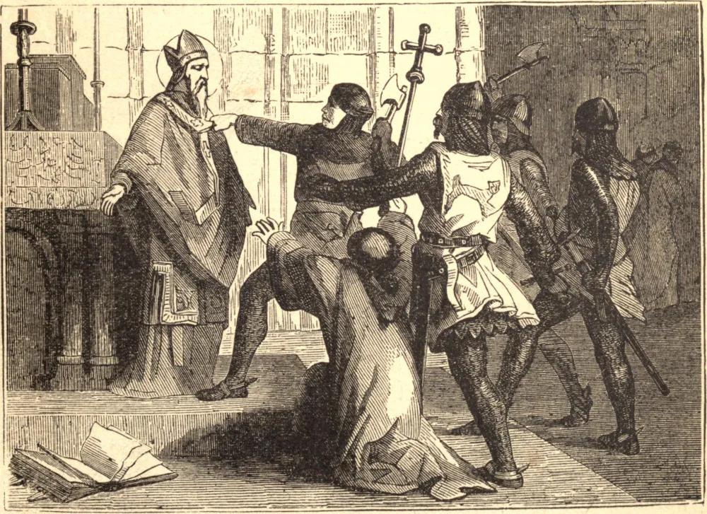

# 29 de dezembro — SÃO TOMÁS DE CANTUÁRIA

SÃO TOMÁS, filho de Gilberto Becket, nasceu em Southwark, na Inglaterra, em 1117. Quando jovem, foi ligado à casa de Teobaldo, Arcebispo de Cantuária, que o enviou a Paris e Bolonha para estudar direito. Tornou-se Arquidiácono de Cantuária, depois Lorde Grão-Chanceler da Inglaterra; e em 1160, quando o Arcebispo Teobaldo faleceu, o rei insistiu na consagração de São Tomás em seu lugar. São Tomás recusou, advertindo o rei de que daquela hora em diante a amizade entre eles estaria rompida. Por fim cedeu, e foi consagrado. O conflito logo irrompeu; São Tomás resistiu aos costumes reais, que violavam as liberdades da Igreja e as leis do reino. Após seis anos de contenda, passados em parte no exílio, São Tomás, com plena previsão do martírio que o aguardava, retornou como bom pastor à sua Igreja. No dia 29 de dezembro de 1170, justamente quando as vésperas começavam, quatro cavaleiros irromperam na catedral, gritando: "Onde está o arcebispo? onde está o traidor?" Os monges fugiram, e São Tomás poderia facilmente ter escapado. Mas ele avançou, dizendo: "Aqui estou — não um traidor, mas o arcebispo. Que buscais?" "A tua vida," gritaram eles. "De bom grado a dou," foi a resposta; e, inclinando a cabeça, o invencível mártir foi golpeado e retalhado até que a sua alma foi para Deus. Seis meses depois, Henrique II submeteu-se a ser publicamente açoitado no santuário do Santo, e restituiu à Igreja os seus plenos direitos.

## Reflexão

"Aprende com São Tomás," diz o Padre Faber, "a combater o bom combate até ao derramamento do sangue, ou, ao que os homens acham mais difícil, ao derramamento do seu bom nome, vertendo-o em desperdício sobre a terra."
