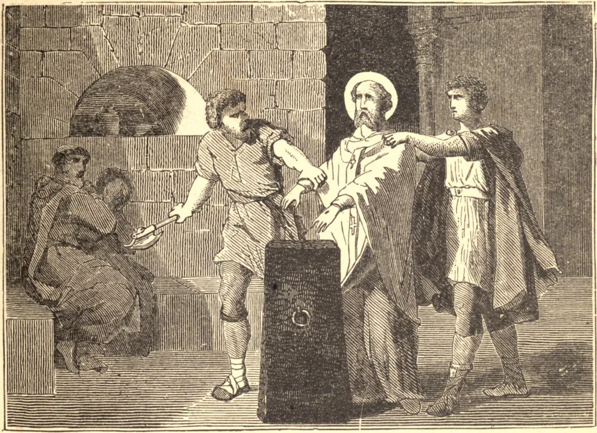

# 30 de dezembro — SÃO SABINO, Bispo, e seus Companheiros, Mártires

PUBLICADOS os cruéis éditos de Diocleciano e Maximino contra os cristãos no ano de 303, Sabino, Bispo de Assis, e vários de seus clérigos foram presos e mantidos sob custódia até que Venustiano, o Governador da Etrúria e da Úmbria, chegasse àquele lugar. À sua chegada àquela cidade, mandou cortar as mãos de Sabino, que fizera diante dele uma gloriosa confissão de sua Fé; e mandou que os seus dois diáconos, Marcelo e Exuperâncio, fossem açoitados, espancados com clavas e dilacerados com unhas de ferro, sob cujos tormentos ambos expiraram. Diz-se que Sabino curou um menino cego, e uma fraqueza nos olhos do próprio Venustiano, o qual por isso se converteu, e foi depois decapitado pela Fé. Lúcio, seu sucessor, ordenou que Sabino fosse espancado até a morte com clavas em Espoleto. O mártir foi sepultado a uma milha daquela cidade, mas as suas relíquias foram desde então trasladadas para Faenza.

## Reflexão

Quão poderosamente clamam a nós os mártires pelo seu exemplo, exortando-nos a desprezar um mundo falso e perverso!
