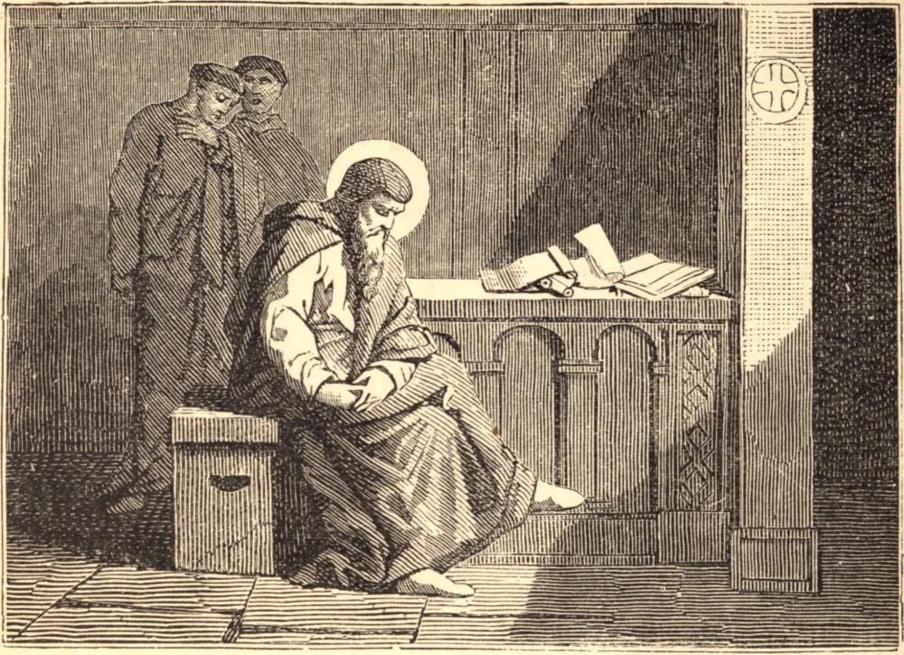

# 31 de dezembro — SÃO SILVESTRE, Papa

SILVESTRE nasceu em Roma por volta do fim do século terceiro. Era um jovem sacerdote quando a perseguição aos cristãos irrompeu sob o tirano Diocleciano. Erguiam-se ídolos nas esquinas das ruas, nas praças do mercado e sobre as fontes públicas, de modo que dificilmente um cristão podia sair à rua sem ser posto à prova de oferecer sacrifício, com a alternativa da apostasia ou da morte. Durante esta provação ardente, Silvestre fortalecia os confessores e mártires, preservando Deus a sua vida de muitos perigos. Em 312, iniciou-se uma nova era. Constantino, tendo triunfado sob o "estandarte da Cruz," declarou-se protetor dos cristãos e edificou-lhes esplêndidas igrejas. Nesta conjuntura, Silvestre foi eleito à cátedra de Pedro, e foi assim o primeiro dos Pontífices Romanos a governar o rebanho de Cristo em segurança e paz. Aproveitou-se destas bênçãos para renovar a disciplina da Igreja, e em dois grandes Concílios confirmou as suas sagradas verdades. No Concílio de Arles condenou o cisma dos donatistas; e no de Niceia, o primeiro Concílio geral da Igreja, desferiu no arianismo o seu golpe de morte ao declarar que Jesus Cristo é o verdadeiro e próprio Deus. Silvestre faleceu no ano 335 d.C.
