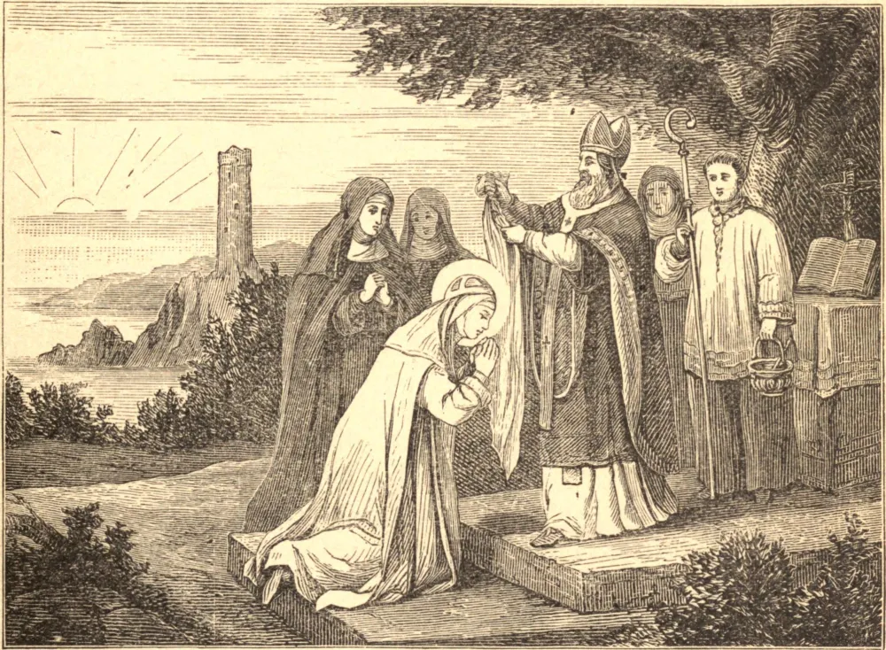

# 1 de fevereiro — SANTA BRÍGIDA, Abadessa e Padroeira da Irlanda

DEPOIS do glorioso São Patrício, Santa Brígida, a quem podemos considerar sua filha espiritual em Cristo, sempre foi tida em singular veneração na Irlanda. Ela nasceu por volta do ano 453, em Fochard, no Ulster. Durante a sua infância, o seu piedoso pai viu em uma visão homens vestidos com trajes brancos derramando um ungüento sagrado sobre a cabeça dela, prefigurando assim a sua futura santidade. Ainda muito jovem, Brígida consagrou a sua vida a Deus, distribuiu tudo o que estava à sua disposição aos pobres, e foi a edificação de todos os que a conheceram. Era muito formosa e, temendo que se fizessem esforços para induzi-la a quebrar o voto pelo qual se ligara a Deus, e a conceder a sua mão a um de seus muitos pretendentes, orou para que se tornasse feia e disforme. A sua oração foi atendida, pois o seu olho inchou, e todo o seu semblante mudou de tal modo que lhe foi permitido seguir a sua vocação em paz, e não se cogitou mais de casamento com ela. Por volta dos vinte anos de idade, a nossa Santa deu a conhecer a São Mel, sobrinho e discípulo de São Patrício, a sua intenção de viver somente para Jesus Cristo, e ele consentiu em receber os seus votos sagrados. No dia marcado, a solene cerimônia de sua profissão realizou-se segundo o modo introduzido por São Patrício, oferecendo o bispo muitas orações e revestindo Brígida com um hábito branco como a neve, e um manto da mesma cor. Enquanto ela inclinava a cabeça nesta ocasião para receber o véu, ocorreu um milagre de natureza singularmente marcante e comovente: aquela parte da plataforma de madeira junto ao altar sobre a qual ela se ajoelhava recobrou a sua vitalidade original e revestiu-se de todo o seu antigo verdor, conservando-o por muito tempo depois. No mesmo instante, o olho de Brígida foi curado, e ela tornou-se tão formosa e encantadora como antes.

Encorajadas pelo seu exemplo, várias outras damas fizeram os seus votos com ela e, atendendo ao desejo dos pais de suas novas companheiras, a Santa concordou em fundar uma residência religiosa para si e para elas na vizinhança. Tendo sido fixado pelo bispo um local conveniente, sobre ele foi erigido um convento, o primeiro da Irlanda; e, em obediência ao prelado, Brígida assumiu a superioridade. A sua reputação de santidade tornava-se maior a cada dia; e, à proporção que se difundia por todo o país, aumentava o número de candidatas à admissão no novo mosteiro. Os bispos da Irlanda, percebendo logo as importantes vantagens que as suas respectivas dioceses obteriam de fundações semelhantes, persuadiram a jovem e santa abadessa a visitar diferentes partes do reino e, conforme se apresentasse a oportunidade, introduzir em cada uma o estabelecimento de seu instituto.

Enquanto assim se ocupava em uma parte da província de Connaught, chegou uma delegação de Leinster para solicitar à Santa que fixasse residência naquele território; mas os motivos que alegavam eram humanos, e tais não podiam ter peso algum para Brígida. Foi apenas a perspectiva das muitas vantagens espirituais que resultariam da anuência ao pedido que a induziu a aceder, como o fez, aos desejos daqueles que a haviam suplicado. Levando consigo várias de suas filhas espirituais, a nossa Santa viajou para Leinster, onde foram recebidas com muitas demonstrações de respeito e alegria. Parecendo bem adequado para um instituto religioso o lugar em que hoje se ergue Kildare, ali a Santa e as suas companheiras fixaram a sua morada. Ao lugar destinado à nova fundação anexaram-se algumas terras, cujos frutos foram designados ao pequeno estabelecimento. Esta doação contribuiu, de fato, para suprir as necessidades da comunidade, mas ainda assim a piedosa irmandade dependia principalmente, para o seu sustento, da liberalidade de seus benfeitores. Brígida conseguia, contudo, com os seus parcos meios, socorrer consideravelmente os pobres da vizinhança; e quando as necessidades dessas pessoas indigentes ultrapassavam as suas escassas finanças, não hesitava em sacrificar por eles os bens móveis do convento. Em certa ocasião, a nossa Santa, imitando a ardente caridade de Santo Ambrósio e de outros grandes servos de Deus, vendeu algumas das vestes sagradas para que pudesse obter os meios de socorrer as suas necessidades. Era tão humilde que, por vezes, cuidava do gado nas terras que pertenciam ao seu mosteiro.

A fama da caridade ilimitada de Brígida atraía multidões de pobres a Kildare; a fama de sua piedade atraía para lá muitas pessoas ansiosas por solicitar as suas orações ou por aproveitar o seu santo exemplo. Com o passar do tempo, o número destes aumentou tanto que se tornou necessário providenciar-lhes acomodação nas imediações do novo mosteiro, e assim foi lançado o fundamento e a origem da cidade de Kildare.

As exigências espirituais de sua comunidade, e a daqueles numerosos forasteiros que afluíam à vizinhança, tendo sugerido à nossa Santa a conveniência de que a localidade fosse erigida em sé episcopal, ela a apresentou aos prelados, a quem por direito cabia a sua consideração. Julgando a proposta justa e útil, Conlath, um recluso de eminente santidade, ilustre pelas grandes coisas que Deus concedera às suas orações, foi, a desejo de Brígida, escolhido o primeiro bispo da diocese recém-erigida. Com o decorrer do tempo, ela tornou-se a metrópole eclesiástica da província a que pertencia, provavelmente em consequência do desejo geral de honrar o lugar em que Santa Brígida tanto tempo habitara.

Após setenta anos consagrados à prática das mais sublimes virtudes, as enfermidades corporais advertiram a nossa Santa de que o tempo de sua dissolução estava próximo. Já fazia meio século que, por seus santos votos, irrevogavelmente se consagrara a Deus, e durante aquele período grandes resultados haviam sido alcançados; tendo o seu santo instituto se difundido amplamente por toda a Ilha Verde, e adiantado grandemente a causa da religião nos vários distritos em que se estabelecera. Como *um rio de paz*, o seu progresso era constante e silencioso; fertilizava toda região afortunada o bastante para receber as suas águas, e fazia-a brotar flores e frutos espirituais com toda a doce fragrância do perfume evangélico. A lembrança da glória que procurara ao Altíssimo, bem como dos serviços prestados às almas queridas resgatadas pelo precioso sangue de seu divino Esposo, alegrava e consolava Brígida nas enfermidades inseparáveis da velhice. A sua última doença foi suavizada pela presença de Nennidh, um sacerdote de eminente santidade, sobre cuja juventude ela velara com piedoso desvelo, e que devia às suas orações e instruções o seu grande progresso na sublime perfeição. Chegado o dia em que a nossa abadessa havia de terminar o seu curso, 1º de fevereiro de 523, recebeu das mãos deste santo sacerdote o bendito corpo e sangue de seu Senhor na divina Eucaristia, e, ao que parece, imediatamente depois o seu espírito partiu, e foi possuí-Lo naquela pátria celestial onde Ele é visto *face a face* e fruído sem perigo de jamais perdê-Lo. O seu corpo foi sepultado na igreja contígua ao seu convento, mas algum tempo depois foi exumado e depositado em um esplêndido santuário junto ao altar-mor.

No século nono, sendo o país devastado pelos dinamarqueses, os restos de Santa Brígida foram removidos a fim de protegê-los da irreverência; e, transferidos para Down-Patrick, foram depositados na mesma sepultura que os do glorioso São Patrício. Os seus corpos, juntamente com o de São Columba, foram depois trasladados para a catedral da mesma cidade, mas o seu monumento foi destruído no reinado do Rei Henrique VIII. A cabeça de Santa Brígida é hoje conservada na igreja dos jesuítas em Lisboa.

## Reflexão

A semelhança exterior com Nossa Senhora foi o privilégio peculiar de Santa Brígida; mas todos estão obrigados a crescer como ela na pureza interior do coração. Esta graça Santa Brígida obteve em grau admirável para as filhas de sua terra natal, e jamais deixará de obtê-la para todos os seus devotos clientes.
