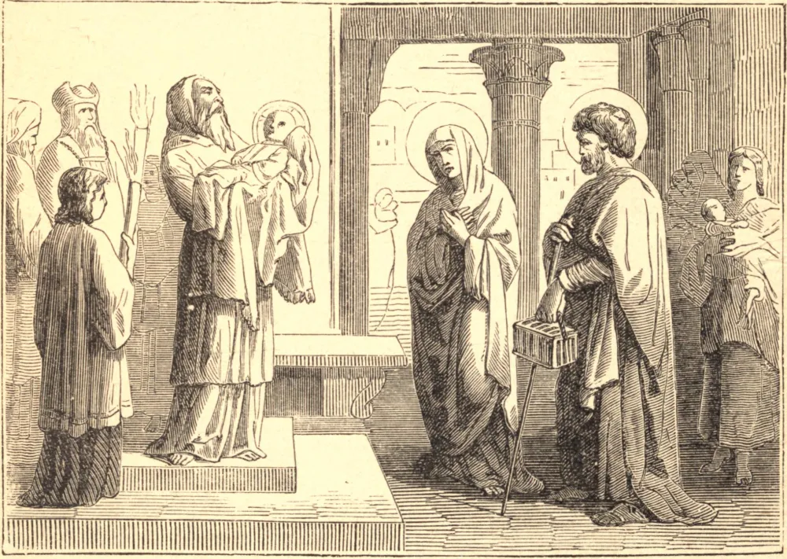

# 2 de fevereiro — A PURIFICAÇÃO, COMUMENTE CHAMADA DIA DE CANDELÁRIA

A lei de Deus, dada por Moisés aos judeus, ordenava que a mulher, após o parto, permanecesse por certo tempo em um estado que aquela lei chama de impuro, durante o qual não devia aparecer em público, nem presumir tocar em coisa alguma consagrada a Deus. Este prazo era de quarenta dias por ocasião do nascimento de um filho, e o dobro desse tempo para uma filha. Expirado o prazo, a mãe devia trazer à porta do tabernáculo, ou Templo, um cordeiro e uma pomba nova, ou rola, como oferenda a Deus. Sendo estes sacrificados a Deus Todo-Poderoso pelo sacerdote, a mulher era purificada da impureza legal e reintegrada em seus privilégios anteriores.

Uma pomba nova, ou rola, a título de oferta pelo pecado, era exigida de todas, ricas ou pobres; mas, como o gasto de um cordeiro pudesse ser excessivo para pessoas em circunstâncias pobres, permitia-se-lhes substituí-lo por uma segunda pomba.

Tendo o nosso Salvador sido concebido pelo Espírito Santo, e permanecendo a sua bendita Mãe sempre virgem imaculada, é evidente que ela não caía sob a lei; mas, como o mundo ainda ignorava a sua concepção milagrosa, submeteu-se com grande pontualidade e exatidão a toda circunstância humilhante que a lei exigia. A devoção e o zelo por honrar a Deus, mediante toda observância prescrita por sua lei, impeliram Maria a realizar este ato de religião, embora evidentemente isenta do preceito. Sendo ela mesma pobre, fez a oferenda designada para os pobres; mas, por mais humilde que fosse em si mesma, foi feita com um coração perfeito em tudo o que Lhe é oferecido. Além da lei que obrigava a mãe a purificar-se, havia outra que ordenava que o filho primogênito fosse oferecido a Deus, e que, após a sua apresentação, a criança fosse resgatada com certa soma de dinheiro, e oferecidos sacrifícios próprios para a ocasião.

Maria cumpre exatamente todas estas ordenanças. Obedece não somente nos pontos essenciais da lei, mas observa estritamente todas as circunstâncias. Permanece quarenta dias em casa; nega a si mesma, durante todo esse tempo, a liberdade de entrar no Templo; não participa das coisas sagradas; e no dia de sua purificação caminha várias milhas até Jerusalém, com o Redentor do mundo nos braços. Espera o sacerdote à porta do Templo, faz as suas oferendas de ação de graças e de expiação, apresenta o seu divino Filho pelas mãos do sacerdote a seu Pai Eterno, com a mais profunda humildade, adoração e ação de graças. Em seguida O resgata com cinco siclos, como a lei determina, e O recebe de volta como um sagrado encargo confiado a seu cuidado especial, até que o Pai novamente O reclame para o pleno cumprimento da redenção do homem.

A cerimônia deste dia foi encerrada por um terceiro mistério — o encontro no Templo das santas pessoas Simeão e Ana com Jesus e seus pais. O santo Simeão, naquela ocasião, recebeu em seus braços o objeto de todos os seus desejos e suspiros, e louvou a Deus por ser bendito com a felicidade de contemplar o Messias tão ansiosamente esperado. Predisse a Maria o seu martírio de dor, e que Jesus trazia a redenção àqueles que a aceitassem nas condições em que lhes era oferecida; mas um pesado juízo sobre todos os infiéis que obstinadamente a rejeitassem, e também sobre os cristãos cujas vidas fossem uma contradição às suas santas máximas e ao seu exemplo. Maria, ouvindo esta terrível predição, não respondeu uma só palavra, não sentiu agitação alguma de espírito quanto ao presente, nem pavor algum quanto ao futuro; mas corajosa e docemente entregou tudo à santa vontade de Deus. Ana, também, a profetisa, que em sua viuvez servia a Deus com grande fervor, teve a felicidade de reconhecer e adorar neste grande mistério o Redentor do mundo. Simeão, tendo contemplado o nosso Salvador, exclamou: "Agora, Senhor, despede o teu servo, segundo a tua palavra, porque os meus olhos viram a tua salvação."

Esta festa é chamada CANDELÁRIA porque a Igreja abençoa as velas que hão de ser levadas na procissão do dia.

**Reflexão**—Esforcemo-nos por imitar a humildade da sempre bendita Mãe de Deus, lembrando-nos de que a humildade é o caminho que conduz à paz permanente e nos aproxima das consolações de Deus.
