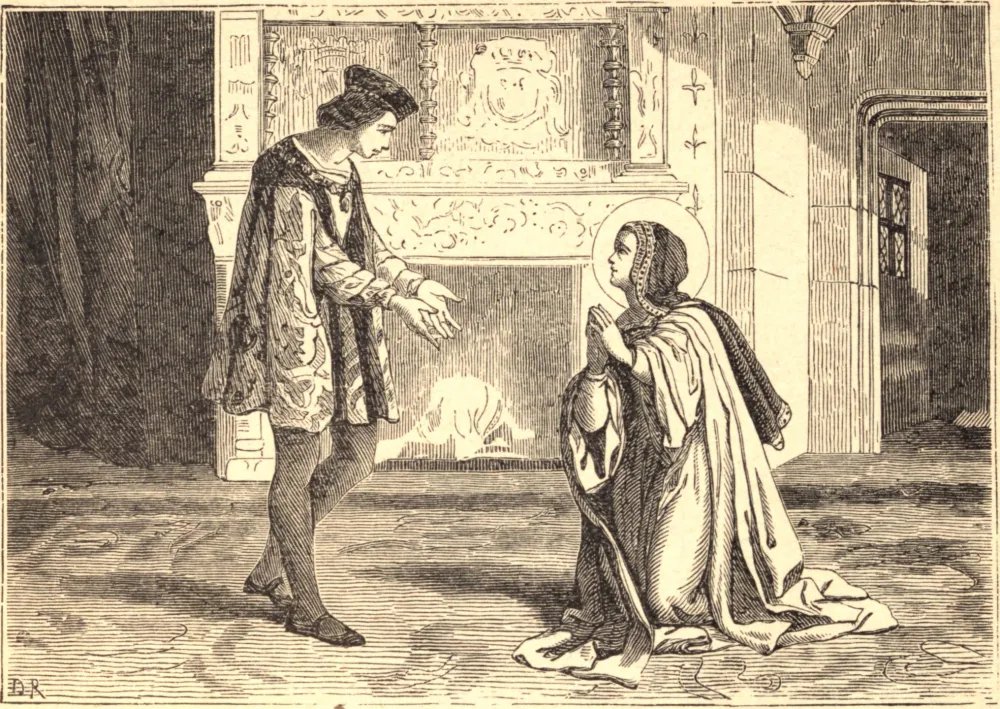

# 4 de fevereiro — SANTA JOANA DE VALOIS

NASCIDA do sangue real da França, ela mesma rainha, Joana de Valois levou uma vida notável por suas humilhações mesmo nos anais dos Santos. O seu pai, Luís XI, que esperara um filho para sucedê-lo, baniu Joana de seu palácio e, segundo se diz, chegou até a atentar contra a sua vida. Aos cinco anos de idade, a criança negligenciada ofereceu todo o seu coração a Deus, e ansiava por prestar algum serviço especial em honra de sua bendita Mãe.

Por desejo do rei, embora contra a sua própria inclinação, foi dada em casamento ao Duque de Orleans. Para com um marido indiferente e indigno, a sua conduta foi sempre paciente e cumpridora ao extremo. As suas orações e lágrimas salvaram-no de uma morte de traidor e abreviaram o cativeiro que a sua rebelião havia merecido. Ainda assim, nada podia conquistar um coração que já estava dado a Outro.

Quando o seu marido ascendeu ao trono como Luís XII, o seu primeiro ato foi repudiar, mediante falsas alegações, aquela que, ao longo de vinte e dois anos de cruel negligência, havia sido sua esposa fiel e leal. Na sentença final de separação, a santa rainha exclamou: "Bendito seja Deus, que permitiu isto, para que eu O sirva melhor do que até agora o fiz." Retirando-se para Bourges, ali realizou o seu desejo há muito acalentado de fundar a Ordem da Anunciação, em honra da Mãe de Deus.

Sob a orientação de São Francisco de Paula, o diretor de sua infância, Santa Joana foi capacitada a vencer os sérios obstáculos que mesmo pessoas boas levantaram contra a fundação de sua nova Ordem. Em 1501, a regra da Anunciação foi finalmente aprovada por Alexandre VI. O principal objetivo do instituto era imitar as dez virtudes praticadas por Nossa Senhora no mistério da Encarnação, sendo a superiora chamada "Ancelle," serva, em honra da humildade de Maria. Santa Joana edificou e dotou o primeiro convento da Ordem em 1502. Morreu em heroica santidade, em 1505, e foi sepultada com a coroa real e a púrpura, sob as quais jazia o hábito de sua Ordem.

**Reflexão**—Durante a vida de Santa Joana, o Angelus foi instituído na França. O som das três vezes a cada dia dava-lhe esperança em sua dor, e fomentava nela o desejo de honrar ainda mais a Encarnação. Quantas vezes poderíamos haurir graça da mesma bela devoção, tão enriquecida pela Igreja, e contudo negligenciada por tantos cristãos!
