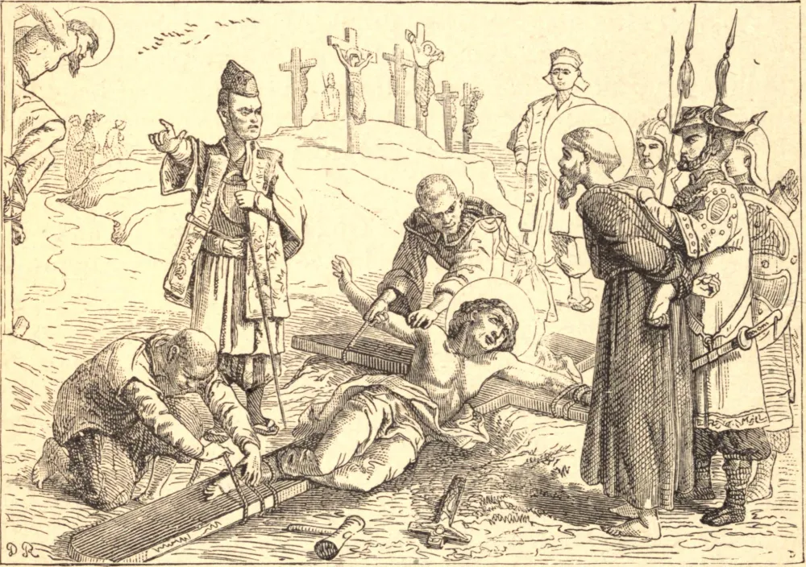

# 5 de fevereiro — OS MÁRTIRES DO JAPÃO

CERCA de quarenta anos após a morte de São Francisco Xavier, irrompeu uma perseguição no Japão, e todos os ritos cristãos foram proibidos sob pena de morte. Formou-se imediatamente uma confraria de mártires, cujo objetivo era morrer por Cristo. Até as criancinhas se uniram a ela.

Pedro, uma criança cristã de seis anos de idade, foi acordado cedo e avisado de que seria decapitado, juntamente com o seu pai. Forte na graça, expressou a sua alegria pela notícia, vestiu as suas roupas mais festivas, e tomou a mão do soldado que devia conduzi-lo à morte. O tronco decapitado de seu pai primeiro lhe surgiu à vista; ajoelhando-se com calma, orou junto ao cadáver e, afrouxando o colarinho, preparou o pescoço para o golpe. Comovido por esta cena tocante, o carrasco atirou ao chão o seu sabre e fugiu. Não se pôde encontrar senão um escravo brutal para a tarefa assassina; com mão inábil e trêmula, ele despedaçou a criança, que por fim morreu sem soltar um único grito.

Os cristãos eram marcados a ferro com a cruz, ou quase enterrados vivos, enquanto a cabeça e os braços eram lentamente serrados com armas embotadas. O menor estremecimento sob a sua angústia era interpretado como apostasia. Os obstinados eram submetidos às mortes mais cruéis, mas os sobreviventes apenas os invejavam. Cinco nobres foram escoltados ao patíbulo por 40.000 cristãos com flores e luzes, cantando as ladainhas de Nossa Senhora enquanto avançavam. No grande martírio, ao qual também assistiram milhares, os mártires elevaram do fogo uma torrente de melodia, que só se extinguia à medida que, um após outro, partiam para cantar o cântico novo no céu.

Mais tarde, inventou-se um suplício ainda mais terrível. As vítimas eram baixadas a um abismo sulfuroso, chamado "boca do inferno," junto ao qual nenhuma ave ou fera podia viver. O chefe destes, Paulo Wiborg, cuja família já fora massacrada pela fé, foi baixado três vezes; três vezes clamou, em alta voz: "Louvor eterno seja ao sempre adorável Sacramento do Altar." Da terceira vez, partiu para a sua recompensa.

**Reflexão**—Se meras crianças enfrentam a tortura e a morte com alegria por Cristo, poderemos nós regatear a leve penitência que Ele nos pede para suportar?
