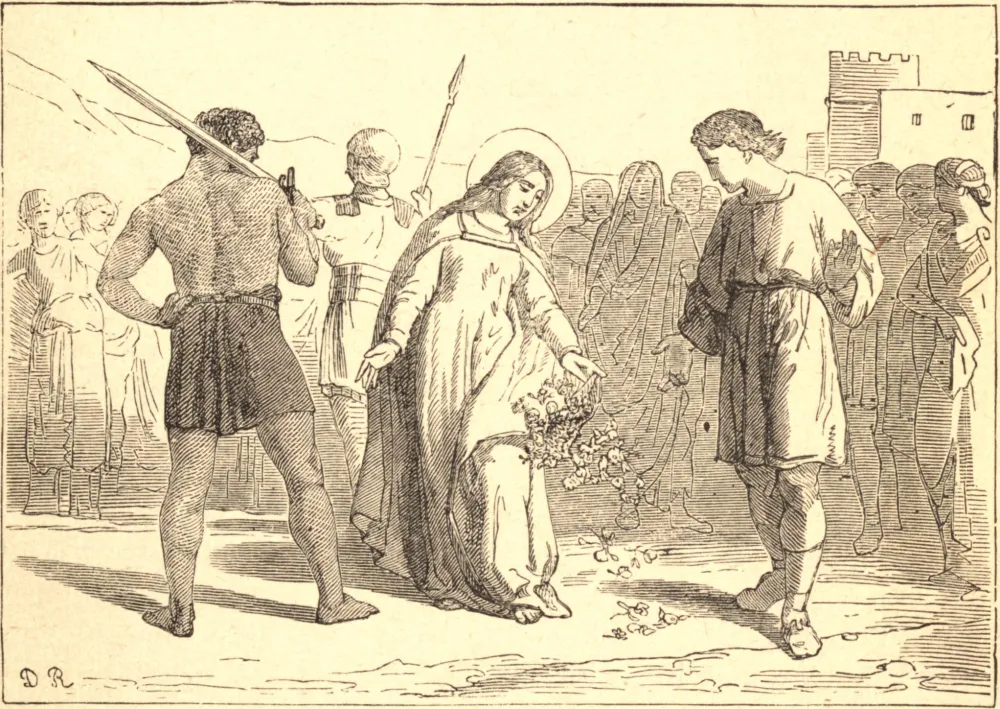

# 6 de fevereiro — SANTA DOROTEIA, Virgem, Mártir

SANTA DOROTEIA era uma jovem virgem, célebre em Cesareia, onde vivia, por sua virtude angélica. Os seus pais parecem ter sido martirizados antes dela na perseguição de Diocleciano e, quando o Governador Saprício veio a Cesareia, chamou-a à sua presença, e enviou esta filha de mártires ao lar onde a aguardavam.

Foi estendida sobre o potro, e lhe ofereceram o casamento se consentisse em sacrificar, ou a morte se recusasse. Mas ela respondeu que "Cristo era o seu único Esposo, e a morte o seu desejo." Foi então posta sob a guarda de duas mulheres que haviam apostatado da fé, na esperança de que a pervertessem; mas o fogo de seu próprio coração reacendeu a chama no delas, e reconduziu-as a Cristo. Quando foi posta mais uma vez sobre o potro, o próprio Saprício pasmou diante do aspecto celestial que ela trazia, e perguntou-lhe a causa de sua alegria. "Porque," disse ela, "reconduzi duas almas a Cristo, e porque em breve estarei no céu regozijando-me com os anjos." A sua alegria crescia à medida que era esbofeteada no rosto e os seus lados queimados com chapas de ferro em brasa. "Bendito sejas," exclamou ela, quando foi sentenciada a ser decapitada, — "bendito sejas, ó Tu, Amante das almas! que me chamas ao Paraíso, e me convidas à tua câmara nupcial."

Santa Doroteia sofreu em pleno inverno, e diz-se que, no caminho para a sua paixão, um advogado chamado Teófilo, que costumava caluniar e perseguir os cristãos, pediu-lhe, por escárnio, que lhe enviasse "maçãs ou rosas do jardim de seu Esposo." A Santa prometeu atender ao seu pedido e, pouco antes de morrer, um menino pôs-se ao seu lado trazendo três maçãs e três rosas. Ela mandou-o levá-las a Teófilo e dizer-lhe que este era o presente que ele buscava do jardim de seu Esposo. Santa Doroteia já partira para o céu, e Teófilo ainda zombava de seu desafio à Santa quando o menino entrou em seu aposento. Ele viu que o menino era um anjo disfarçado, e que o fruto e as flores não eram de crescimento terreno algum. Converteu-se à fé, e em seguida partilhou do martírio de Santa Doroteia.

## Reflexão

Desejas estar seguro nos prazeres e feliz nas tribulações do mundo? Ora por desejos celestiais, e dize, com São Filipe: "Paraíso, Paraíso!"
