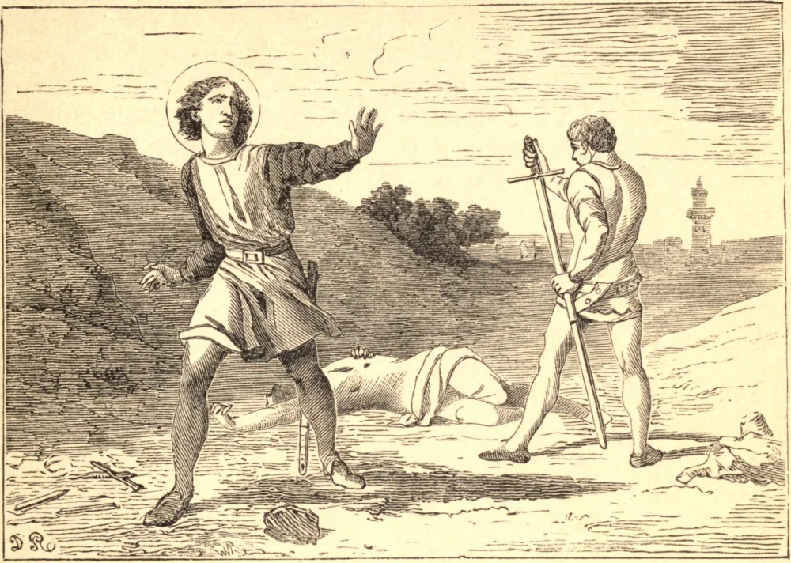

# 7 de fevereiro — SÃO ROMUALDO, Abade

EM 976, Sérgio, um nobre de Ravena, brigou com um parente por causa de uma propriedade, e matou-o em um duelo. O seu filho Romualdo, horrorizado com o crime do pai, entrou no mosteiro beneditino de Classe, para fazer por ele uma penitência de quarenta dias. Esta penitência terminou em sua própria vocação à vida religiosa. Após três anos em Classe, Romualdo foi viver como eremita perto de Veneza, onde se lhe juntou Pedro Urseolo, Duque de Veneza, e juntos levaram uma vida austeríssima em meio a assaltos dos espíritos malignos. São Romualdo fundou muitos mosteiros, o principal dos quais foi o de Camaldoli, um lugar de deserto agreste, onde edificou uma igreja, que cercou com diversas celas separadas para os solitários que viviam sob a sua regra. Os seus discípulos foram por isso chamados camaldulenses. Diz-se que aqui ele teve uma visão de uma escada mística, e de seus monges vestidos de branco subindo por ela ao céu. Entre os seus primeiros discípulos estavam Santos Adalberto e Bonifácio, apóstolos da Rússia, e Santos João e Bento da Polônia, mártires pela fé. Foi amigo íntimo do Imperador Santo Henrique, e era reverenciado e consultado por muitos grandes homens de seu tempo. Certa vez passou sete anos em solidão e completo silêncio.

Em sua juventude, São Romualdo foi muito atormentado por tentações da carne. Para delas escapar, recorreu à caça e, nos bosques, concebeu primeiro o seu amor pela solidão. O pecado de seu pai, como vimos, impeliu-o primeiramente a empreender uma penitência de quarenta dias no mosteiro, que logo fez sua morada. Algum mau exemplo de seus companheiros monges induziu-o a deixá-los e a adotar o modo de vida solitário. A penitência de Urseolo, que obtivera o seu poder injustamente, trouxe-lhe o seu primeiro discípulo; as tentações do demônio compeliram-no à sua vida severa; e, por fim, as perseguições de outros foram a ocasião de seu estabelecimento em Camaldoli, e da fundação de sua Ordem. Morreu, como predissera vinte anos antes, sozinho, em seu mosteiro de Val Castro, no dia 19 de junho de 1027.

## Reflexão

A vida de São Romualdo nos ensina que, se apenas seguirmos o impulso do Espírito Santo, facilmente encontraremos o bem em toda parte, ainda nas ocasiões mais improváveis. Os nossos próprios pecados, os pecados dos outros, a má vontade deles para conosco, ou os nossos próprios erros e infortúnios, são igualmente capazes de conduzir-nos, com o coração abrandado, aos pés da misericórdia e do amor de Deus.
