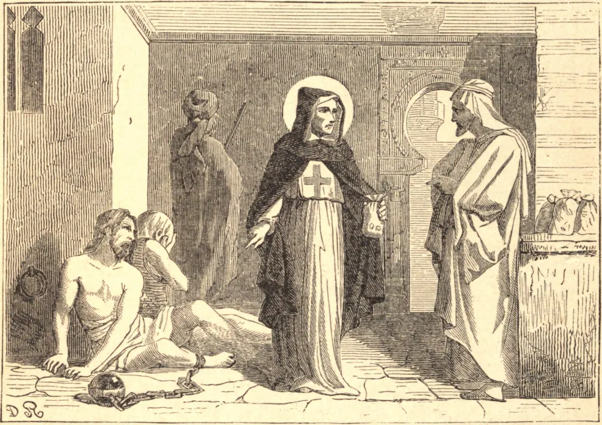

# 8 de fevereiro — SÃO JOÃO DE MATHA

A vida de São João de Matha foi um longo curso de abnegação pela glória de Deus e o bem do próximo. Quando criança, o seu principal deleite era servir os pobres; e muitas vezes lhes dizia que viera ao mundo sem outro fim senão o de lavar-lhes os pés. Estudou em Paris com tanta distinção que os seus professores o aconselharam a tornar-se sacerdote, a fim de que os seus talentos pudessem prestar maior serviço aos outros; e, para este fim, João de bom grado sacrificou a sua alta posição e outras vantagens mundanas. Em sua primeira Missa, apareceu um anjo, vestido de branco, com uma cruz vermelha e azul sobre o peito, e as mãos repousando sobre as cabeças de um cativo cristão e de um mouro. Para averiguar o que isto significava, João dirigiu-se a São Félix de Valois, um santo eremita que vivia perto de Meaux, sob cuja direção levou uma vida de extrema penitência. O anjo apareceu novamente, e então partiram para Roma, a fim de conhecer a vontade de Deus dos lábios do Soberano Pontífice, que lhes disse que se dedicassem à redenção dos cativos. Para este propósito, fundaram a Ordem da Santíssima Trindade. Os religiosos jejuavam todos os dias e, recolhendo esmolas por toda a Europa, levavam-nas à Berbéria, para resgatar os escravos cristãos. Dedicavam-se também aos enfermos e aos prisioneiros em todos os países. A caridade de São João, ao consagrar a sua vida à redenção dos cativos, foi visivelmente abençoada por Deus. Em seu segundo regresso de Túnis, trouxe consigo cento e vinte escravos libertados. Mas os mouros atacaram-no no mar, dominaram a sua embarcação e a destinaram à destruição, com todos os que estavam a bordo, retirando-lhe o leme e as velas, e deixando-a à mercê dos ventos. São João atou o seu manto ao mastro, e orou, dizendo: "Levante-se Deus, e sejam dispersados os seus inimigos. Ó Senhor, tu salvarás os humildes, e abaterás os olhos dos soberbos." Subitamente o vento encheu a pequena vela e, sem direção, conduziu a nau em segurança, em poucos dias, a Óstia, o porto de Roma, a trezentas léguas de Túnis. Esgotado por seus heroicos labores, João morreu em 1213, aos cinquenta e três anos de idade.

## Reflexão

Jamais nos esqueçamos de que o nosso bendito Senhor nos ordenou amar o próximo não somente como a nós mesmos, mas como Ele nos amou, Ele que depois Se sacrificou por nós.
