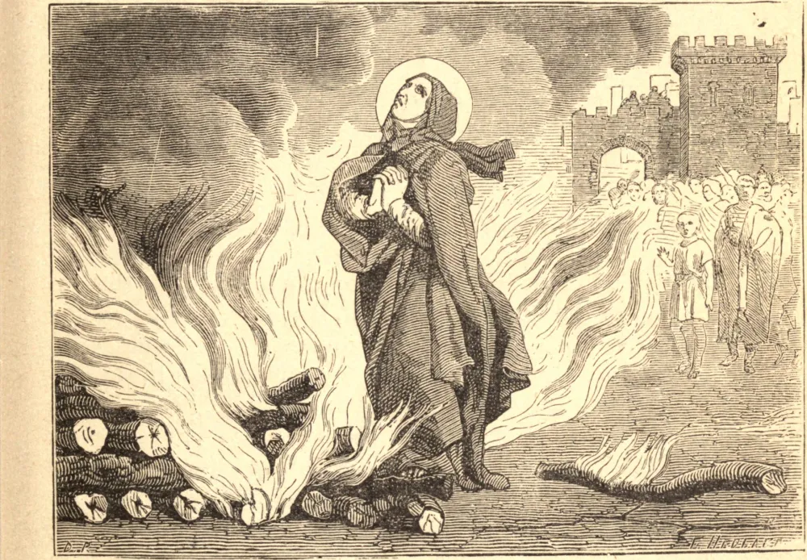

# 9 de fevereiro — SANTA APOLÔNIA E OS MÁRTIRES DE ALEXANDRIA

EM Alexandria, no ano 249, a turba levantou-se em fúria selvagem contra os cristãos. Metras, um ancião, pereceu primeiro. Os seus olhos foram traspassados com canas, e ele foi apedrejado até a morte. Uma mulher chamada Quinta foi a vítima seguinte. Foi conduzida a um templo pagão e ordenada a adorar. Respondeu amaldiçoando o falso deus uma e outra vez, e também ela foi apedrejada até a morte. Depois disso, as casas dos cristãos foram saqueadas e pilhadas. Eles sofreram o despojo de seus bens com toda a alegria.

Santa Apolônia, uma virgem idosa, foi a mais célebre entre os mártires. Os seus dentes foram arrancados a golpes; foi conduzida para fora da cidade, acendeu-se uma enorme fogueira, e disseram-lhe que devia negar Cristo, ou então ser queimada viva. Ficou em silêncio por algum tempo e, depois, movida por uma inspiração especial do Espírito Santo, lançou-se ao fogo e morreu em suas chamas. A mesma coragem manifestou-se no ano seguinte, quando Décio se tornou imperador, e a perseguição cresceu tanto que parecia que os próprios eleitos haveriam de apostatar.

A história de Dioscoro ilustra a coragem dos cristãos alexandrinos, e o apreço que tinham pelo martírio. Era um menino de quinze anos. Aos argumentos do juiz, devolvia sábias respostas: era inabalável à tortura. Os seus companheiros mais velhos foram executados, mas Dioscoro foi poupado por causa de sua tenra idade; contudo, os cristãos não podiam suportar a ideia de que fora privado da coroa do martírio, a não ser para recebê-la depois mais gloriosamente. "Dioscoro," escreve Dionísio, Bispo de Alexandria naquele tempo, "permanece conosco, reservado para algum combate mais longo e maior."

Houve, de fato, muitos cristãos que vieram, pálidos e trêmulos, oferecer os sacrifícios pagãos. Mas os próprios juízes ficaram horrorizados diante das multidões que se precipitavam ao martírio. As mulheres triunfavam sobre a tortura, até que por fim os juízes se alegravam em executá-las de imediato e pôr fim à ignomínia de sua própria derrota.

**Reflexão**—Muitos santos, que não foram mártires, anelaram derramar o seu sangue por Cristo. Nós também podemos orar por alguma porção de seu espírito; e o menor sofrimento pela fé, suportado com humildade e coragem, é a prova de que Cristo ouviu a nossa oração.
