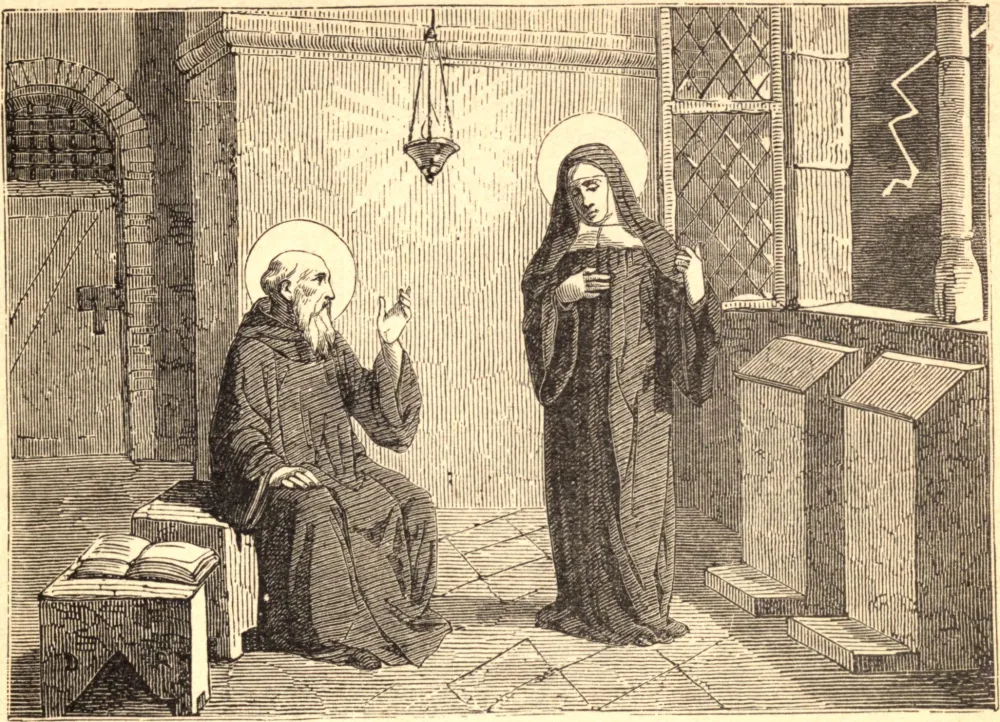

# 10 de fevereiro — SANTA ESCOLÁSTICA, Abadessa

DESTA Santa pouco se sabe na terra, salvo que era irmã do grande patriarca São Bento, e que, sob a sua direção, fundou e governou uma numerosa comunidade próxima de Monte Cassino. São Gregório resume a sua vida dizendo que ela se consagrou a Deus desde a infância, e que a sua alma pura subiu a Deus à semelhança de uma pomba, como que para mostrar que a sua vida fora enriquecida com os mais plenos dons do Espírito Santo. O seu irmão costumava visitá-la todos os anos, pois "ela não se podia saciar nem cansar das palavras de graça que fluíam dos lábios dele." Em sua última visita, depois de um dia passado em conversa espiritual, a Santa, sabendo que o seu fim estava próximo, disse: "Meu irmão, não me deixes, eu te peço, esta noite, mas conversa comigo até a aurora sobre a bem-aventurança daqueles que veem a Deus no céu." São Bento não quis quebrar a sua regra ao apelo do afeto natural; então a Santa inclinou a cabeça sobre as mãos e orou; e levantou-se uma tempestade tão violenta que São Bento não pôde voltar ao seu mosteiro, e passaram a noite em conversa celestial. Três dias depois, São Bento viu numa visão a alma de sua irmã subindo à semelhança de uma pomba para o céu. Então deu graças a Deus pelas graças que Ele lhe concedera, e pela glória que as coroara. Quando ela morreu, São Bento, as suas filhas espirituais e os monges enviados por São Bento misturaram as suas lágrimas e oraram: "Ai! ai! mãe queridíssima, a quem nos deixas agora? Roga por nós a Jesus, a Quem foste." Então celebraram devotamente a santa Missa, "encomendando a sua alma a Deus;" e o seu corpo foi levado a Monte Cassino, e colocado por seu irmão no túmulo que ele preparara para si mesmo. "E choraram-na por muitos dias;" e São Bento disse: "Não choreis, irmãs e irmãos; pois certamente Jesus a tomou antes de nós para ser nosso auxílio e defesa contra todos os nossos inimigos, para que possamos estar firmes no dia mau e sermos em todas as coisas perfeitos." Ela morreu por volta do ano 543.

## Reflexão

Os nossos parentes devem ser amados em Deus e por Deus; do contrário, o mais puro afeto torna-se desordenado e é, nessa medida, subtraído a Ele.
