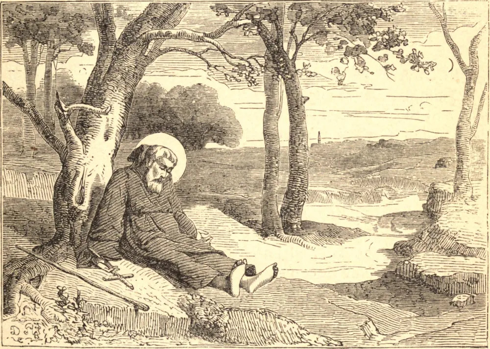

# 12 de fevereiro — SÃO BENTO DE ANIANE

BENTO era filho de Aigulfo, Governador do Languedoc, e nasceu por volta de 750. Em sua primeira juventude serviu como copeiro do Rei Pepino e de seu filho Carlos Magno, gozando sob eles de grandes honras e posses. A graça entrou em sua alma aos vinte anos de idade, e resolveu buscar o reino de Deus de todo o coração. Sem renunciar ao seu lugar na corte, viveu ali uma vida mortificadíssima por três anos; depois, uma estreita fuga de afogar-se fê-lo fazer voto de deixar o mundo, e entrou no claustro de São Seine. Em recompensa de suas heroicas austeridades no estado monástico, Deus concedeu-lhe o dom das lágrimas e inspirou-lhe o conhecimento das coisas espirituais.

Como procurador, era cuidadosíssimo com as necessidades dos irmãos, e hospitaleiríssimo com os pobres e os hóspedes. Recusando aceitar o cargo de abade, edificou para si uma pequena ermida junto ao ribeiro Aniane, e viveu alguns anos em grande solidão e pobreza; mas, atraindo a fama de sua santidade muitas almas em torno de si, foi obrigado a edificar uma grande abadia, e dentro de pouco tempo governava trezentos monges.

Tornou-se o grande restaurador da disciplina monástica por toda a França e a Alemanha. Primeiro, compôs com imenso labor um código das regras de São Bento, seu grande homônimo, que cotejou com as dos principais fundadores monásticos, mostrando a uniformidade dos exercícios em cada uma, e impôs por seu "Penitencial" a sua exata observância; segundo, regulou minuciosamente todas as matérias relativas ao alimento, ao vestuário e a cada detalhe da vida; e terceiro, prescrevendo o mesmo para todos, excluiu as invejas e assegurou a perfeita caridade. Num Concílio Provincial realizado em 813, sob Carlos Magno, ao qual esteve presente, declarou-se que todos os monges do Ocidente deveriam adotar a regra de São Bento. Morreu a 11 de fevereiro de 821.

**Reflexão**—A decadência da disciplina monástica e a sua restauração por São Bento provam que ninguém está a salvo da perda do fervor, mas que todos o podem recobrar pela fidelidade à graça.
