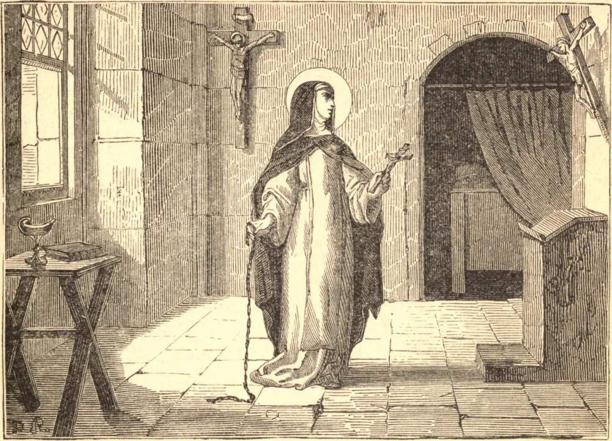

# 13 de fevereiro — SANTA CATARINA DE RICCI

ALEXANDRINA de Ricci era filha de um nobre florentino. Aos treze anos de idade entrou na Terceira Ordem de São Domingos no mosteiro de Prato, tomando na religião o nome de Catarina, em honra de sua padroeira e homônima de Sena. A sua atração especial era pela Paixão de Cristo, na qual lhe foi permitido participar miraculosamente. Na Quaresma de 1541, tendo então vinte e um anos de idade, teve uma visão da crucifixão tão dilacerante que ficou confinada ao leito por três semanas, e só foi restabelecida, no Sábado Santo, por uma aparição de Santa Maria Madalena e de Jesus ressuscitado. Durante doze anos passou todas as sextas-feiras em êxtase. Recebeu os sagrados estigmas, a chaga do lado esquerdo e a coroa de espinhos. Todos estes favores lhe davam sofrimento contínuo e intenso, e inspiravam-lhe uma amorosa compaixão pelos tormentos ainda mais amargos das Santas Almas. Em favor delas oferecia todas as suas orações e penitências; e a sua caridade para com elas tornou-se tão famosa por toda a Toscana que, após cada morte, os amigos do falecido acorriam a Catarina para assegurar as suas orações. Santa Catarina ofereceu muitas orações, jejuns e penitências por certo grande homem, e assim obteve a sua salvação. Foi-lhe revelado que ele estava no purgatório; e tal era o seu amor a Jesus crucificado que se ofereceu para sofrer todas as penas que estavam para ser infligidas àquela alma. A sua oração foi atendida. A alma entrou no céu, e por quarenta dias Catarina sofreu agonias indescritíveis. O seu corpo cobriu-se de bolhas, emitindo um calor tão grande que a sua cela parecia em chamas. A sua carne parecia como assada, e a sua língua como ferro em brasa. Em meio a tudo permanecia calma e jubilosa, dizendo: "Anseio por sofrer todas as dores imagináveis, para que as almas vejam e louvem prontamente o seu Redentor." Conhecia por revelação a chegada de uma alma ao purgatório, e a hora de sua libertação. Mantinha trato com os Santos na glória, e frequentemente conversava com São Filipe Néri em Roma sem jamais deixar o seu convento em Prato. Morreu, em meio a cânticos de anjos, em 1589.

## Reflexão

Se verdadeiramente amamos a Jesus crucificado, devemos ansiar, como Santa Catarina, por libertar as Santas Almas que Ele redimiu, mas que deixou à nossa caridade para que as ponhamos em liberdade.
