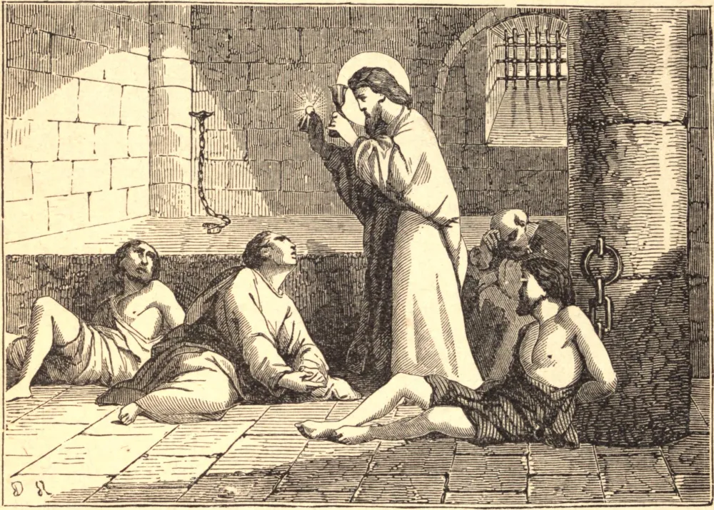

# 14 de fevereiro — SÃO VALENTIM, Sacerdote e Mártir

VALENTIM era um santo sacerdote em Roma, que, com São Mário e sua família, assistia aos mártires na perseguição sob Cláudio II. Foi preso e enviado pelo imperador ao prefeito de Roma, o qual, achando ineficazes todas as suas promessas para fazê-lo renunciar à sua fé, mandou que fosse espancado com clavas e depois decapitado, o que se executou no dia 14 de fevereiro, por volta do ano 270. Diz-se que o Papa Júlio I edificou uma igreja próxima a Ponte Mole à sua memória, que por longo tempo deu nome ao portão hoje chamado Porta del Popolo, antigamente Porta Valentini. A maior parte de suas relíquias acha-se agora na Igreja de Santa Práxedes. Para abolir o lascivo e supersticioso costume pagão de os meninos sortearem os nomes das meninas, em honra de sua deusa Februata Juno, no dia 15 deste mês, vários zelosos pastores substituíram-no pelos nomes de Santos em bilhetes distribuídos neste dia.

## Reflexão

Na causa da justiça e da verdade, a prudência não deve ser levada em conta; do contrário, a prudência é mero respeito humano. São Paulo diz: "A sabedoria da carne é morte."
