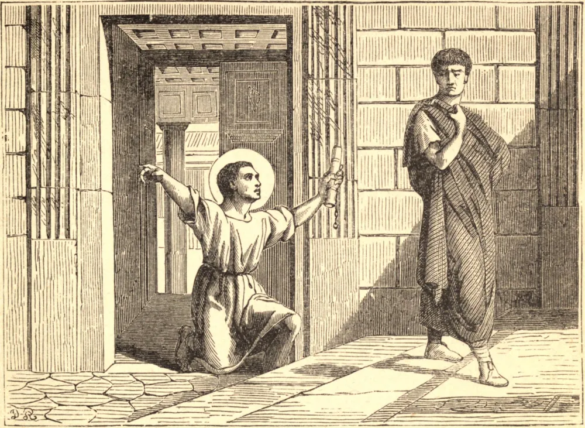

# 16 de fevereiro — SÃO ONÉSIMO, Discípulo de São Paulo

ERA frígio de nascimento, escravo de Filêmon, pessoa de nota da cidade de Colossos, convertido à fé por São Paulo. Tendo roubado o seu senhor e sendo obrigado a fugir, encontrou-se providencialmente com São Paulo, então prisioneiro pela fé em Roma, que ali o converteu e batizou, e o enviou com a sua carta canônica de recomendação a Filêmon, por quem foi perdoado, posto em liberdade e reenviado a seu pai espiritual, a quem depois serviu fielmente.

Aquele apóstolo fê-lo, com Tíquico, portador de sua Epístola aos Colossenses, e depois, como testemunham São Jerônimo e outros Padres, pregador do Evangelho e bispo. Foi coroado com o martírio sob Domiciano no ano 95.

**Reflexão**—Com que excesso de bondade se comunica Deus às almas que a Ele se abrem! Com que carícias frequentemente as visita! Com que profusão de graças as enriquece e fortalece! Em nossas provações e tentações ofereçamos, pois, os nossos corações a Deus, recordando, como diz São Paulo, que "aos que amam a Deus todas as coisas concorrem para o bem."
