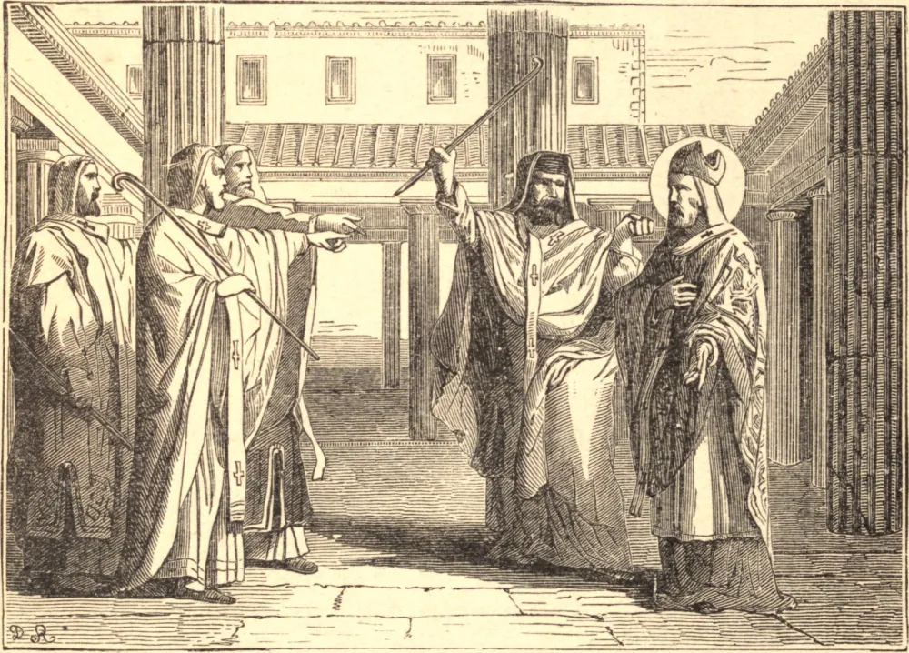

# 17 de fevereiro — SÃO FLAVIANO, Bispo, Mártir

FLAVIANO foi eleito Patriarca de Constantinopla em 447. O seu breve episcopado de dois anos foi, desde o início, um tempo de conflito e perseguição. Crisáfio, o favorito do imperador, tentou extorquir dele uma grande soma de dinheiro por ocasião de sua consagração. A sua fidelidade em recusar esta simoníaca traição de seu encargo trouxe-lhe a inimizade do homem mais poderoso do império.

Logo surgiu um problema mais grave. Em 448, Flaviano teve de condenar a nascente heresia do monge Êutiques, que obstinadamente negava que Nosso Senhor estivesse em duas naturezas perfeitas após a sua Encarnação. Êutiques atraiu à sua causa todos os maus elementos que tão cedo se agruparam em torno da corte bizantina. As suas intrigas foram por longo tempo frustradas pela vigilância de Flaviano; mas afinal obteve do imperador a reunião de um concílio em Éfeso, em agosto de 449, presidido por seu amigo Dióscoro, Patriarca de Alexandria. A este "concílio dos ladrões", como é chamado, entrou Êutiques, rodeado de soldados. Os legados romanos não puderam sequer ler as cartas do Papa; e ao primeiro sinal de resistência à condenação de Flaviano, novas tropas entraram com as espadas desembainhadas, e, apesar dos protestos dos legados, aterrorizaram a maior parte dos bispos até à submissão.

A fúria de Dióscoro atingiu o seu auge quando Flaviano apelou para a Santa Sé. Foi então que ele de tal modo se esqueceu de seu ofício apostólico a ponto de lançar mãos violentas sobre o seu adversário. São Flaviano foi atacado por Dióscoro e outros, derrubado, espancado, escoiceado e, por fim, levado ao desterro. Contrastemos os seus fins. Flaviano apegou-se ao ensino do Pontífice Romano, e selou a sua fé com o seu sangue. Dióscoro excomungou o Vigário de Cristo, e morreu obstinado e impenitente na heresia de Êutiques.

## Reflexão

Por sua inabalável lealdade ao Vigário de Cristo, Flaviano apegou-se firmemente à verdade e ganhou a coroa do martírio. Aprendamos com ele a voltar-nos instintivamente para aquele único guia verdadeiro em todas as matérias concernentes à nossa salvação.
