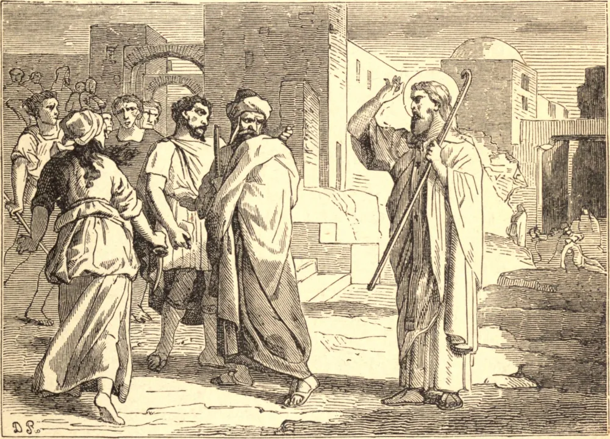

# 18 de fevereiro — SÃO SIMEÃO, Bispo, Mártir

SÃO SIMEÃO era filho de Cléofas, de outro modo chamado Alfeu, irmão de São José, e de Maria, irmã da Santíssima Virgem. Era, portanto, sobrinho tanto de São José como da Santíssima Virgem, e primo de Nosso Salvador. Não podemos duvidar de que foi um precoce seguidor de Cristo, e de que recebeu o Espírito Santo no dia de Pentecostes, com a Santíssima Virgem e os apóstolos. Quando os judeus massacraram São Tiago Menor, seu irmão Simeão censurou-os por sua atroz crueldade. Sendo São Tiago, Bispo de Jerusalém, levado à morte no ano 62, vinte e nove anos após a Ressurreição de Nosso Salvador, os apóstolos e discípulos reuniram-se em Jerusalém para lhe nomear um sucessor. Escolheram unanimemente São Simeão, que provavelmente já antes auxiliara seu irmão no governo daquela Igreja.

No ano 66, no qual São Pedro e São Paulo sofreram o martírio em Roma, a guerra civil começou na Judeia, pelas sedições dos judeus contra os romanos. Os cristãos em Jerusalém foram advertidos por Deus da iminente destruição daquela cidade. Por isso partiram dela no mesmo ano — antes que Vespasiano, general de Nero, e depois imperador, entrasse na Judeia — e retiraram-se para além do Jordão, a uma pequena cidade chamada Pella, tendo São Simeão à sua frente. Após a tomada e o incêndio de Jerusalém, voltaram para lá novamente, e estabeleceram-se em meio às suas ruínas, até que Adriano depois a arrasou inteiramente. A Igreja aqui floresceu, e multidões de judeus foram convertidas pelo grande número de prodígios e milagres ali operados.

Vespasiano e Domiciano haviam ordenado que fossem mortos todos os que fossem da raça de Davi. São Simeão escapara às suas buscas; mas, tendo Trajano dado a mesma ordem, certos hereges e judeus acusaram o Santo, como sendo ao mesmo tempo da raça de Davi e cristão, a Ático, o governador romano na Palestina. O santo bispo foi condenado a ser crucificado. Depois de ter padecido os tormentos habituais durante vários dias, os quais, embora tendo cento e vinte anos, sofreu com tanta paciência que atraiu sobre si uma universal admiração, e a de Ático em particular, morreu em 107. Deve ter governado a Igreja de Jerusalém cerca de quarenta e três anos.

## Reflexão

Trazemos o nome de cristãos, mas estamos cheios do espírito dos mundanos, e as nossas ações estão infectadas com o veneno do mundo. Buscamo-nos secretamente a nós mesmos, ainda quando nos lisonjeamos de que Deus é o nosso único fim; e enquanto empreendemos converter o mundo, deixamos que ele nos perverta. Quando começaremos a estudar como crucificar as nossas paixões e morrer para nós mesmos, a fim de lançarmos um sólido fundamento de verdadeira virtude e estabelecermos o seu reinado em nossos corações?
