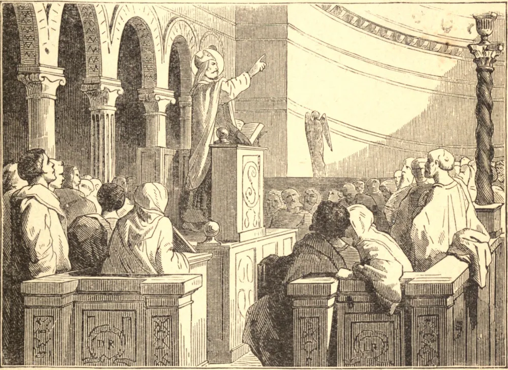

# 19 de fevereiro — SÃO BARBATO, Bispo

SÃO BARBATO nasceu no território de Benevento, na Itália, perto do fim do pontificado de São Gregório Magno, no princípio do século sétimo. Seus pais deram-lhe uma educação cristã, e Barbato, em sua juventude, lançou o fundamento daquela eminente santidade que o recomenda à nossa veneração. A inocência, a simplicidade e a pureza de seus costumes, e o seu extraordinário progresso em todas as virtudes, qualificaram-no para o serviço do altar, ao qual foi admitido recebendo Ordens Sacras tão logo os cânones da Igreja o permitiram. Foi imediatamente empregado por seu bispo na pregação, para a qual tinha um talento extraordinário, e, depois de algum tempo, foi feito cura de São Basílio em Morcona, uma cidade próxima de Benevento. Os seus paroquianos estavam empedernidos em suas irregularidades, e trataram-no como perturbador de sua paz, e perseguiram-no com a máxima violência. Achando a sua malícia vencida por sua paciência e humildade, e o seu caráter brilhando ainda mais resplandecente, recorreram a calúnias, nas quais a sua virulência e o seu êxito foram tais que ele foi obrigado a retirar os seus caritativos esforços entre eles. Barbato voltou a Benevento, onde foi recebido com alegria. Quando São Barbato deu início ao seu ministério naquela cidade, os próprios cristãos conservavam muitas superstições idolátricas, que até o seu duque, o Príncipe Romualdo, autorizava com o seu exemplo, embora fosse filho de Grimoaldo, Rei dos Lombardos, que edificara toda a Itália com a sua conversão. Manifestavam uma religiosa veneração por uma víbora de ouro, e prostravam-se diante dela; prestavam também honra supersticiosa a uma árvore, na qual penduravam a pele de uma fera; e essas cerimônias eram encerradas com jogos públicos, nos quais a pele servia de alvo ao qual os arqueiros atiravam flechas por sobre os ombros. São Barbato pregou zelosamente contra estes abusos, e por fim despertou a atenção do povo predizendo a aflição de sua cidade, e as calamidades que ela havia de sofrer pelo exército do Imperador Constante, o qual, desembarcando pouco depois na Itália, pôs cerco a Benevento. Morrendo Ildebrando, Bispo de Benevento, durante o cerco, depois de restaurada a tranquilidade pública, São Barbato foi consagrado bispo a 10 de março de 663. Barbato, investido do caráter episcopal, prosseguiu e completou a boa obra que tão felizmente começara, e destruiu todo vestígio de superstição em todo o estado. No ano 680 assistiu a um concílio realizado pelo Papa Agatão em Roma, e no ano seguinte ao Sexto Concílio Geral realizado em Constantinopla contra os monotelitas. Não sobreviveu muito a esta grande assembleia, pois morreu a 29 de fevereiro de 682, tendo cerca de setenta anos de idade, dos quais quase dezenove passara na cadeira episcopal.

## Reflexão

Santo Agostinho diz: "Quando o inimigo houver sido expulso de vossos corações, renunciai-o, não somente em palavra, mas em obra; não somente pelo som dos lábios, mas em cada ato de vossa vida."
