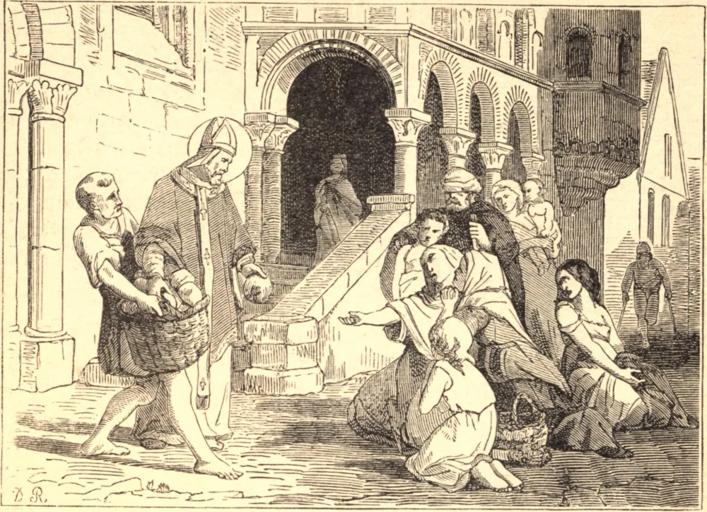

# 20 de fevereiro — SANTO EUQUÉRIO, Bispo

ESTE Santo nasceu em Orleans, de uma família mui ilustre. Ao seu nascimento, seus pais consagraram-no a Deus, e puseram-no a estudar quando tinha apenas sete anos de idade, resolvidos a não omitir nada do que pudesse ser feito para cultivar a sua mente ou formar o seu coração. O seu progresso na virtude acompanhava o seu progresso no saber: meditava assiduamente nos sagrados escritos, especialmente no modo de São Paulo falar do mundo e de seus gozos como meras sombras vãs que nos enganam e se desvanecem. Estas reflexões por fim penetraram tão fundo em sua mente que ele resolveu deixar o mundo.

Para pôr em execução este desígnio, por volta do ano 714 retirou-se para a abadia de Jumièges, na Normandia, onde passou seis ou sete anos na prática de austeridades penitenciais e na obediência. Tendo morrido Suavárico, seu tio, Bispo de Orleans, o senado e o povo, com o clero daquela cidade, pediram permissão para eleger Euquério para a sé vacante. O Santo suplicou aos seus monges que o protegessem dos perigos que o ameaçavam; mas eles preferiram o bem público às suas inclinações particulares, e cederam-no para aquele importante encargo. Foi consagrado com universal aplauso em 721.

Carlos Martel, para custear as despesas de suas guerras e outras empresas, despojava frequentemente as igrejas de suas rendas. Santo Euquério repreendeu estas usurpações com tanto zelo que, no ano 737, Carlos o baniu para Colônia. A extraordinária estima que a sua virtude lhe granjeou naquela cidade moveu Carlos a ordenar que fosse conduzido dali a um lugar forte no território de Liège. Roberto, o governador daquele país, ficou de tal modo encantado com a sua virtude que o fez distribuidor de suas grandes esmolas, e permitiu-lhe retirar-se para o mosteiro de Sarchinium, ou São Trond. Aqui a oração e a contemplação foram a sua única ocupação até o ano 743, no qual morreu, a 20 de fevereiro.

**Reflexão**—Nada amolece a alma e enfraquece a piedade tanto quanto a indulgência frívola. Deus revelou em quão alta conta tem o "retiro" nestas palavras: "Eu a levarei à solidão, e falarei ao seu coração."
