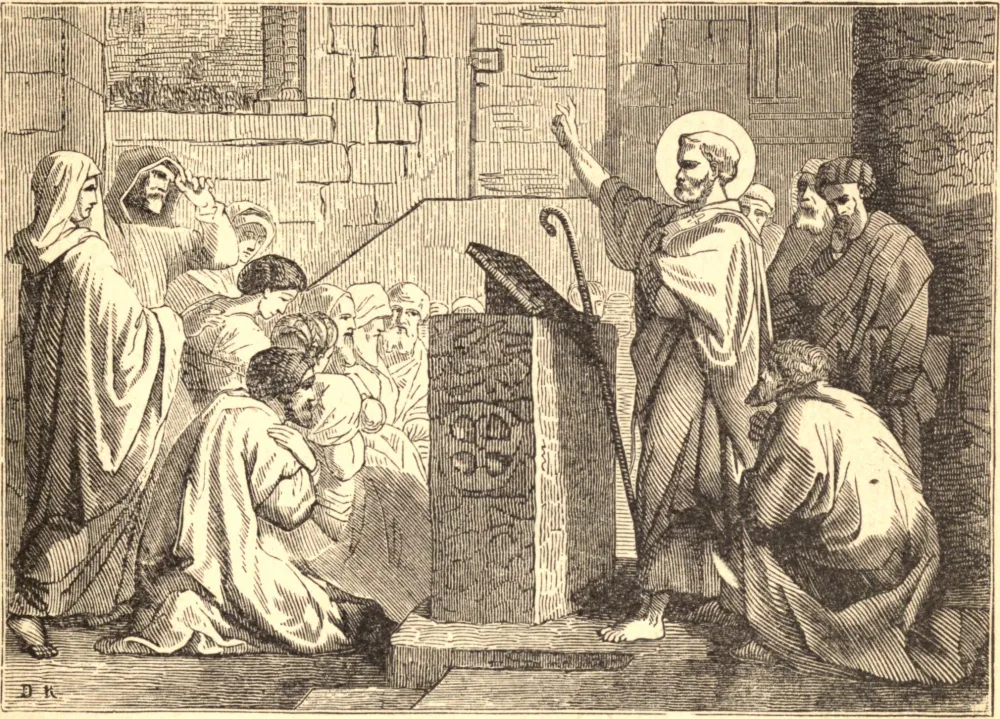

# 22 de fevereiro — A CÁTEDRA DE SÃO PEDRO EM ANTIOQUIA

QUE São Pedro, antes de ir a Roma, fundou a sé de Antioquia é atestado por muitos Santos. Era justo que o Príncipe dos Apóstolos tomasse esta cidade sob seu particular cuidado e inspeção, a qual era então a capital do Oriente, e na qual a fé lançou raízes tão precoces e tão profundas que ali deu origem ao nome de cristãos. São Crisóstomo diz que São Pedro ali fez longa permanência; São Gregório Magno, que foi por sete anos Bispo de Antioquia; não que residisse ali todo esse tempo, mas apenas que teve um cuidado particular por aquela Igreja. Se ocupou por vinte e cinco anos a sé de Roma, a data do estabelecimento de sua cátedra em Antioquia deve situar-se dentro de três anos após a Ascensão de Nosso Salvador; pois nessa suposição ele deve ter ido a Roma no segundo ano de Cláudio.

Nos primeiros séculos era costume, especialmente no Oriente, que cada cristão guardasse o aniversário de seu Batismo, no qual renovava seus votos batismais e dava graças a Deus por sua adoção celestial: a isto chamavam seu aniversário espiritual. Os bispos da mesma forma guardavam o aniversário de sua própria consagração, como se vê de quatro sermões de São Leão sobre o aniversário de sua ascensão ou elevação à dignidade pontifícia; e isto era frequentemente continuado após sua morte pelo povo, por respeito à sua memória. São Leão diz que devemos celebrar a cátedra de São Pedro com não menor alegria do que o dia de seu martírio; pois assim como neste ele foi exaltado a um trono de glória no céu, assim por aquela foi instalado cabeça da Igreja na terra.

**Reflexão**—Nesta festividade estamos especialmente obrigados a adorar e a agradecer à Divina Bondade pelo estabelecimento e propagação de Sua Igreja, e a rogar fervorosamente que em Sua misericórdia a preserve, e dilate seus limites, para que Seu nome seja glorificado por todas as nações, e por todos os corações, até os confins da terra, para Sua divina honra e a salvação das almas, formadas à Sua divina imagem, e preço de Seu adorável sangue.
