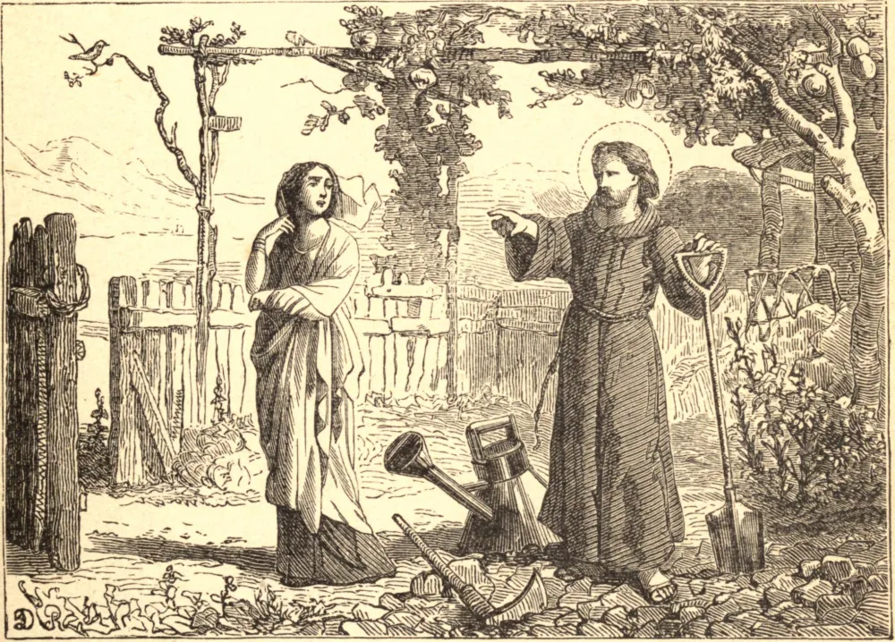

# SÃO SERENO, um Jardineiro, Mártir

SERENO era grego de nascimento. Abandonou bens, amigos e pátria para servir a Deus em celibato, penitência e oração. Com este desígnio comprou um jardim em Sírmio, na Panônia, que cultivava com suas próprias mãos, e vivia dos frutos e ervas que ele produzia.

Um dia veio até ali uma mulher, com suas duas filhas. Sereno, vendo-as aproximar-se, aconselhou-as a retirar-se, e a conduzir-se no futuro como a decência exigia de pessoas de seu sexo e condição. A mulher, ferida pela caridosa admoestação de nosso Santo, retirou-se confusa, mas resolvida a vingar a suposta afronta. Escreveu, pois, ao seu marido que Sereno a havia insultado. Este, ao receber sua carta, foi ao imperador para exigir justiça, ao que o imperador lhe deu uma carta para o governador da província, a fim de capacitá-lo a obter satisfação.

O governador ordenou que Sereno fosse imediatamente trazido à sua presença. Sereno, ao ouvir a acusação, respondeu: "Lembro-me de que, há algum tempo, uma senhora veio ao meu jardim em hora imprópria, e confesso que tomei a liberdade de dizer-lhe que era contra a decência que alguém de seu sexo e qualidade estivesse fora a tal hora." Tendo esta defesa de Sereno feito o oficial corar pela conduta de sua esposa, ele desistiu da acusação. Mas o governador, suspeitando por esta resposta que Sereno pudesse ser cristão, começou a interrogá-lo, dizendo: "Quem és tu, e qual é a tua religião?" Sereno, sem hesitar um momento, respondeu: "Sou cristão. Há pouco parecia que Deus me rejeitava como uma pedra imprópria para entrar em Seu edifício, mas Ele tem a bondade de tomar-me agora para nele me colocar; estou pronto a sofrer todas as coisas por Seu nome, para que eu tenha parte em Seu reino com Seus Santos."

O governador, ao ouvir isto, irrompeu em fúria e disse: "Visto que procuraste eludir pela fuga os éditos do imperador, e recusaste positivamente sacrificar aos deuses, condeno-te por estes crimes a perder a cabeça." Mal foi pronunciada a sentença, o Santo foi levado e decapitado, no dia 23 de fevereiro, no ano de 307.

**Reflexão**—O jardim oferece um belo emblema do contínuo progresso de um cristão no caminho da virtude. As plantas sempre se elevam para cima, e jamais cessam em seu crescimento até haverem atingido aquela maturidade que o Autor da natureza lhes prescreveu. Assim, num cristão, tudo deve conduzi-lo àquela perfeição que a santidade de seu estado requer; e cada desejo de sua alma, cada ação de sua vida deve ser um passo que avança para isto em linha reta.
