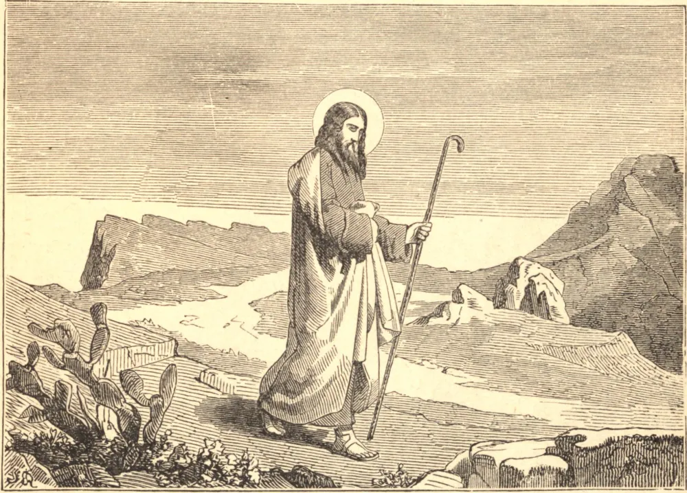

# 24 de fevereiro — SÃO MATIAS, Apóstolo

DEPOIS da Ascensão de nosso bendito Senhor, Seus discípulos reuniram-se, com Maria Sua mãe e os onze apóstolos, num cenáculo em Jerusalém. A pequena companhia não contava mais que cento e vinte almas. Esperavam a prometida vinda do Espírito Santo, e perseveravam em oração. Entrementes, havia um ato solene a ser realizado da parte da Igreja, que não podia ser adiado. O lugar do caído Judas devia ser preenchido, para que o número eleito dos apóstolos ficasse completo. São Pedro, portanto, como Vigário de Cristo, ergueu-se para anunciar o decreto divino. Aquilo que o Espírito Santo havia falado pela boca de Davi a respeito de Judas, disse ele, devia ser cumprido. Dele estava escrito: "Tome outro o seu episcopado." Uma escolha, portanto, devia ser feita de um dentre aqueles que haviam sido seus companheiros desde o princípio, que pudesse dar testemunho da Ressurreição de Jesus. Dois foram nomeados, de igual mérito: José chamado Barsabás, e Matias. Então, após orarem a Deus, que conhece os corações de todos os homens, para que mostrasse qual destes Ele havia escolhido, lançaram sortes, e a sorte caiu sobre Matias, que foi logo contado entre os apóstolos. Registra-se do Santo, assim maravilhosamente eleito a tão alta vocação, que ele era acima de tudo notável por sua mortificação da carne. Foi assim que tornou certa a sua eleição.

## Reflexão

Nossa ignorância de muitos pontos da vida de São Matias serve para fixar a atenção tanto mais firmemente sobre estes dois — a ocasião de seu chamado ao apostolado, e o fato de sua perseverança. Voltamo-nos então naturalmente em pensamento para a nossa própria vocação e o nosso próprio fim.
